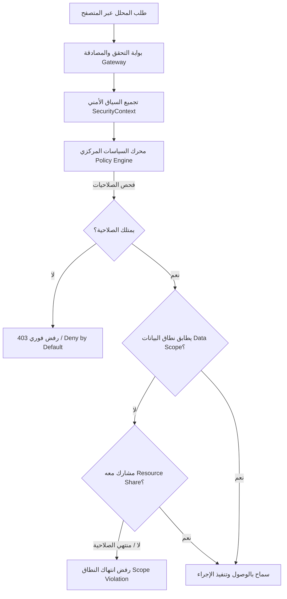

# دليل الاستخدام الرسمي لمنصة التحليل الأمني الموحدة
# Unified Security Analysis Platform — User Guide

مرحباً بك في دليل الاستخدام الرسمي لبوابة التحليل الأمني الموحدة. يهدف هذا الدليل إلى توفير مرجع عملي وتشغيلي شامل ومفصل لفرق مراكز العمليات الأمنية (SOC) ومحللي الحوادث الجنائية (DFIR) وهندسة الكشف (Detection Engineers).

---

## جدول المحتويات (Table of Contents)

1. [البدء السريع وإعداد الحساب](#quick-start)
2. [التنقل في المنصة والواجهة الرئيسية](#platform-navigation)
3. [إدارة المستخدمين والصلاحيات (RBAC)](#users-and-rbac)
4. [إدارة الحوادث الأمنية (Incident Management)](#incident-management)
5. [هندسة وقواعد الكشف (Detection Engineering)](#detection-engineering)
6. [استوديو ومعيار قواعد Sigma العالمية](#sigma-studio)
7. [استخبارات التهديدات ومؤشرات الاختراق (Threat Intelligence & IOCs)](#threat-intelligence)
8. [سجل وذكاء الأصول الأمنية (Asset Inventory & Intelligence)](#asset-inventory)
9. [الترابط الجنائي وسلاسل الهجوم (Graph Correlation & Attack Chains)](#graph-correlation)
10. [وحدة FlowScope لتحليل تدفقات الشبكة](#flowscope)
11. [وحدة LogScope لتحليل سجلات الأمان والأحداث الموحدة](#logscope)
12. [وحدة ThreatScope لتحليل تهديدات XDR والتجزئات](#threatscope)
13. [رفع الملفات واختيار النظام المصدري](#file-upload-and-sources)
14. [متابعة التحليل وقراءة النتائج](#analysis-workflow)
15. [الإثراء الخارجي وسمعة التهديدات (Threat Enrichment)](#external-enrichment)
16. [الذكاء الاصطناعي والمساعد الأمني التفاعلي (AI Security Copilot & Ollama)](#ai-advisor)
17. [تصدير التقارير الجنائية (Word وExcel ومعاينة PDF المباشرة)](#reporting)
18. [سجل التدقيق والأمان (Audit Logs)](#audit-logs)
19. [إعدادات المنصة والهوية البصرية](#platform-settings)
20. [إدارة مصادر التحليل والأنظمة المتكاملة](#source-systems)
21. [استكشاف الأخطاء وإصلاحها (Troubleshooting)](#troubleshooting)
22. [سيناريوهات الاستخدام العملية (Practical SOC Scenarios)](#practical-scenarios)
23. [الأسئلة الشائعة (Frequently Asked Questions - FAQ)](#faq)
24. [الجاهزية المؤسسية وحوكمة التخزين والعناقيد (Enterprise SOC Hardening)](#enterprise-hardening)
25. [العمليات والمراقبة المركزية وسجلات المنصة (Platform Logging & Observability)](#platform-observability)
26. [مركز الإدارة والحوكمة المؤسسية (Central Administration Hub & Governance Layer)](#central-administration)
27. [البحث العالمي الموحد والتنقل السريع (Global Search & Ctrl+K)](#global-search)
28. [مساحة التحقيقات وقضايا SOC المتكاملة (SOC Investigation Workspace)](#investigations-workspace)
29. [النسخ الاحتياطي والاستعادة والحوكمة الزمنية (Backup & Recovery Management)](#backup-recovery)

---

<a id="quick-start"></a>
## 1. البدء السريع وإعداد الحساب (Quick Start)

### متطلبات الوصول إلى المنصة
المنصة عبارة عن نظام أمني مستقل يعمل عبر المتصفح دون الحاجة لتثبيت أي ملحقات إضافية على جهاز المحلل. تدعم المنصة العمل عبر الشبكة المحلية (LAN) أو من الجهاز المحلي:
- **الرابط المحلي (Local)**: `http://127.0.0.1:3000`
- **رابط الشبكة المحلية (Network)**: يظهر في مخرجات المشغل مثل `http://192.168.x.x:3000`

### تسجيل الدخول الأول
1. افتح رابط المنصة في المتصفح، وسيتم توجيهك تلقائياً إلى صفحة تسجيل الدخول `/login`.
2. أدخل بيانات الحساب الافتراضي للمسؤول:
   - **اسم المستخدم (Username)**: `admin`
   - **كلمة المرور الافتراضية (Password)**: `admin123` (أو كلمة المرور المحددة أثناء الإعداد الأولي).
3. اضغط على زر **تسجيل الدخول**.
4. عند تسجيل الدخول بنجاح، يتم إنشاء جلسة آمنة (HTTP-Only Secure Cookie) صالحة لمدة 12 ساعة (قابلة للضبط من الإعدادات).

> [!IMPORTANT]
> **إجراء أمني إلزامي**: فور أول تسجيل دخول بحساب المسؤول الافتراضي، انتقل فوراً إلى صفحة **إدارة الحساب** `/account` أو **المستخدمين** `/users` وقم بتغيير كلمة المرور الافتراضية إلى كلمة مرور قوية ومعقدة.

### تغيير كلمة المرور والبيانات الشخصية
1. اضغط على بطاقة المستخدم الظاهرة أقصى يسار شريط التنقل العلوي (Navbar).
2. في شاشة `/account`، يمكنك:
   - تحديث **الاسم الظاهر (Display Name)**.
   - إدخال كلمة المرور الحالية ثم كلمة المرور الجديدة وتأكيدها.
   - الضغط على **حفظ التغييرات**.

---

<a id="platform-navigation"></a>
## 2. التنقل في المنصة والواجهة الرئيسية (Platform Navigation)

صُممت واجهة المنصة لتوفر تجربة استخدام فائقة السلاسة باللغة العربية بالكامل مع دعم اتجاه القراءة من اليمين إلى اليسار (RTL). تعتمد المنصة نظام تنقل مزدوج يجمع بين **شريط علوي مدمج** و**قائمة جانبية رأسية أنيقة وحصرية (Cyber SOC Sidebar)** على الجهة اليمنى:

### القائمة الجانبية الحصرية على اليمين (Right-Hand SOC Sidebar)
تتمركز القائمة الجانبية على الجهة اليمنى من الشاشة وتستعرض كافة وحدات وميزات المنصة بتنسيق زجاجي احترافي، مصنفة في 4 مجموعات وظيفية متكاملة:
1. **المراقبة والتحقيق المباشر (Monitoring & Investigation)**:
   - **الرئيسية (نظرة عامة)** `/`: لوحة مراقبة شاملة وحالة الاتصال للوحدات الرئيسية.
   - **إدارة الحوادث الأمنية** `/incidents`: إدارة وتتبع الحوادث الأمنية وسجل التحقيق الجنائي.
   - **سجلات الأحداث الموحدة** `/logs`: استعراض وتصفية السجلات والأحداث الموحدة.
   - **الترابط وسلاسل الهجوم** `/correlation`: التحليل الطوبولوجي ورصد مسارات التنقل الأفقي والتهديد الداخلي.
2. **وحدات التحليل الجنائي (Forensic Engines)**:
   - **FlowScope** `/flowscope`: تحليل تدفقات وحركة الشبكة وملفات PCAP و NetFlow.
   - **LogScope** `/logscope`: استيعاب وتحليل سجلات الأمان وجدران الحماية عبر معمارية `CanonicalEvent`.
   - **ThreatScope** `/threatscope`: تحليل سجلات XDR وتتبع التهديدات والبصمات الرقمية.
3. **الاستخبارات وهندسة الكشف (Threat Intel & Detections)**:
   - **قواعد الكشف واستوديو Sigma** `/detections`: هندسة وتأليف واختبار ومحاكاة قواعد الكشف وفق مصفوفة MITRE.
   - **استخبارات التهديدات المركزية** `/intel`: قاعدة مؤشرات الاختراق (IOCs) وتكامل STIX 2.1 والفحص السريع.
   - **سجل وذكاء الأصول الأمنية** `/assets`: فهرس الأجهزة والخوادم وحل الهوية وخطط العزل التفاعلي.
4. **الإدارة والعمليات المؤسسية (Enterprise & Administration)**:
   - **إعدادات المنصة والهوية** `/settings`: خيارات المنصة والذكاء الاصطناعي والثيمات وحوكمة التخزين.
   - **إدارة المستخدمين والصلاحيات** `/admin`: إدارة حسابات المحللين ومصفوفة الصلاحيات (للمشرفين).
   - **دليل الاستخدام ومركز المساعدة** `/help`: الدليل التفاعلي المدمج والبحث الفوري.

> [!TIP]
> **تمييز العناوين الرئيسية وخلفيات المجموعات (Distinct Category & Section Header Backgrounds)**:
> تتميز كافة العناوين الرئيسية ومجموعات القوائم (في القائمة الجانبية لمركز العمليات SOC، وشريط فئات الإعدادات الجانبي، وفهرس مركز المساعدة، وبطاقات أقسام الإعدادات `SectionCard`) بخلفيات لونية حاوية ومتباينة وإطارات أنيقة ومؤشرات لونية عمودية مع عدادات رقمية فورية، مما يوفر فصلاً بصرياً فورياً يسهل على المحلل تمييز الفئات الرئيسية عن العناصر والروابط التابعة لها بسرعة ووضوح تام عبر كافة الثيمات.

### التحكم بإظهار وإخفاء القائمة الجانبية (Collapsible Sidebar)
- **زر التبديل في الشريط العلوي**: زر أنيق مدمج في أعلى يمين الشريط العلوي (`z-50`) يظل ظاهراً ومتاحاً للنقر دائماً سواء كانت القائمة مفتوحة أو مغلقة دون أي حجب أو تداخل، ويعرض حالة القائمة الحالية مع تلميح تفاعلي.
- **زر التبديل في الشريط العلوي**: زر أنيق مدمج في أعلى يمين الشريط العلوي (`z-50`) يظل ظاهراً ومتاحاً للنقر دائماً سواء كانت القائمة مفتوحة أو مغلقة دون أي حجب، وتظهر إشارة اختصار لوحة المفاتيح `Ctrl+B` بتصميم عائم أنيق (Hover Tooltip) فقط عند تمرير مؤشر الفأرة فوق الزر لإبقاء الواجهة نظيفة ومرتبة.
- **اختصار لوحة المفاتيح**: يمكن التبديل السريع بين إظهار وإخفاء القائمة في أي وقت عبر الضغط على `Ctrl + B` (أو `Cmd + B`).
- **تجاوب المحتوى (Responsive Layout Shift)**: عند فتح القائمة على الشاشات الكبيرة (≥ 1280px)، يبتعد محتوى الصفحة بسلاسة عبر مساحة حشو يمنى (`padding-right: 18rem`) مما يحافظ على توسيط البطاقات والجداول (`mx-auto`) ويمنع تداخلها مع الفهارس الفرعية. بينما تنزلق كطبقة عائمة انسيابية (Drawer) على الشاشات اللوحية والهواتف مع خلفية معتمة خفيفة (Backdrop).
- **التحكم المباشر عبر الروابط (URL Query Control)**: تدعم المنصة توجيه الروابط بحالة محددة مسبقاً للقائمة عبر المعاملين `?sidebar=open` و `?sidebar=closed`.
- **تذكر التفضيل تلقائياً**: يتم حفظ حالة القائمة (مفتوحة أو مخفية) في التخزين المحلي للمتصفح (`localStorage`) لمنع أي وميض وتطبيق تفضيل المحلل فور تحميل الصفحة.
- **تثبيت التمرير التلقائي وحفظ موضع القوائم (Active Section Auto-Scroll & Scroll Locking)**: عند النقر على أي قسم أو رابط يقع في أسفل القائمة الجانبية لمركز العمليات (SOC)، أو شريط فئات الإعدادات، أو جدول محتويات دليل المساعدة، تقوم المنصة تلقائياً بحفظ موضع التمرير في جلسة المتصفح وتوجيه شريط القائمة لتثبيت العنصر النشط داخل إطار الرؤية المباشر (`scrollIntoView`) دون أن ترتد القوائم إلى البداية، مما يوفر تجربة تصفح مستقرة ومريحة للمحلل.

### الشريط العلوي المدمج (Compact Topbar)
يحتوي الشريط العلوي ذو الارتفاع المنخفض على العناصر التشغيلية السريعة:
- **شعار المنصة**: رمز الدرع المتوهج واسم المنصة المخصص.
- **أزرار التنقل الداخلي (Back & Forward Navigation)**: أداة تنقل سريعة مدمجة في الشريط العلوي تضم زري الرجوع للخلف (`Back`) والتقدم للأمام (`Forward`) داخل المنصة مباشرة، وتعمل بشكل متكامل ومستقل عن أزرار المتصفح الخارجية مع مراعاة كاملة لاتجاه القراءة (RTL/LTR) وتأثيرات بصرية تفاعلية عند النقر.
- **مؤشر النبض المباشر**: مؤشر اتصال مركز العمليات (SOC Live).
- **سجل العمليات (History)**: زر تفاعلي يعرض عداد المهام الحديثة ويفتح نافذة العمليات السريعة.
- **دليل الاستخدام**: اختصار مباشر لمركز المساعدة.
- **بطاقة المستخدم والملف الشخصي**: لعرض الاسم المسجل والانتقال لصفحة الحساب `/account`.
- **تسجيل الخروج**: زر إنهاء الجلسة الآمن.

### بطاقات التحليل في الصفحة الرئيسية
في الصفحة الرئيسية `/`، تظهر بطاقات الوحدات الثلاث الأساسية بتصميم زجاجي عصري:
- **FlowScope**: لتحليل حركة الشبكة وملفات PCAP و NetFlow.
- **LogScope**: لتحليل سجلات الأنظمة والأجهزة وجدران الحماية عبر نموذج الأحداث الموحد `CanonicalEvent`.
- **ThreatScope**: لتحليل سجلات XDR والبصمات الرقمية وتتبع التهديدات المتقدمة.

### مظهر المنصة والثيمات المتعددة (Themes)
تدعم المنصة نظام ثيمات موحد يتكيف تلقائياً ويشمل:
- **الداكن الكلاسيكي (Dark)**: النمط الافتراضي المريح لبيئات مراكز العمليات (SOC).
- **الفاتح (Light)**: وضع عالي التباين للقراءة والطباعة النهارية.
- **منتصف الليل (Midnight)**: درجات أزرق ليلي عميق.
- **الجرافيت (Graphite)**: تدرجات رمادية معدنية احترافية.
- **البحرية (Navy)**: أزرق بحري ملكي مخصص للمحللين.

---

<a id="users-and-rbac"></a>
## 3. إدارة المستخدمين والصلاحيات (Users & RBAC)
## 3. إدارة المستخدمين والصلاحيات والتحكم في نطاق البيانات (Centralized RBAC & ABAC Engine)

تعتمد المنصة نموذج تحكم بالوصول قائم على الصلاحيات والأدوار (Role-Based Access Control) يضمن مبدأ الحد الأدنى من الامتيازات (Least Privilege).
تعتمد المنصة محركاً مركزياً متقدماً للتحكم بالوصول والتفويض يجمع بين **التحكم القائم على الأدوار (RBAC)** و**التحكم القائم على الخصائص ونطاق البيانات (ABAC)**، وفق مبدأ الأمان الصارم **«الحظر افتراضياً» (Deny by Default)**، مع فرض التحقق الفعلي الصارم في خادم الخلفية (Server-Side Enforcement) لحماية كافة الموارد من ثغرات الوصول غير المصرح والتلاعب المباشر (IDOR / BOLA Prevention).

### الصلاحيات الأساسية في النظام
- `flowscope.analyze` / `flowscope.view`: رفع ملفات الشبكة وبدء تحليلات FlowScope واستعراض نتائجها.
- `logscope.analyze` / `logscope.view`: رفع سجلات الأمان وتحليلها وقراءة مخرجات LogScope.
- `threatscope.analyze` / `threatscope.view`: فحص التهديدات المتقدمة والتجزئات الرقمية.
- `incidents.view` / `incidents.manage`: قراءة الحوادث الأمنية وتحديث حالاتها، وإنشاء أدلة جنائية.
- `detections.view` / `detections.manage`: عرض قواعد الكشف، وتأليف واختبار قواعد Sigma ونشرها.
- `intel.view` / `intel.manage`: البحث في مؤشرات الاختراق، وإضافة واستيراد/تصدير حزم STIX ومؤشرات IOCs.
- `assets.view`: الوصول إلى سجل الأصول الأمنية واستعراض التقييم ومؤشر المخاطر والخط الزمني.
- `assets.manage`: إضافة وتعديل الأصول وتحديث البيانات واستيراد وتصدير بيانات CMDB.
- `assets.isolate`: صلاحية احتواء وعزل الأصول وتوليد وتأكيد أوامر الحجر (Containment Actions).
- `correlation.view`: استعراض الرسم البياني الجنائي وسلاسل الهجوم والترابط الطوبولوجي.
- `correlation.manage`: تشغيل تحليلات الترابط وإدارة عتبات الكشف وترقية الأنماط إلى حوادث.
- `history.view`: الوصول إلى سجل العمليات والمهام السابقة.
- `users.manage`: إنشاء وإدارة وتعديل حسابات المستخدمين وصلاحياتهم.
- `system.view` / `system.manage`: إدارة إعدادات المنصة، الهوية البصرية، ومصادر التحليل.


### الأدوار الافتراضية
1. **المسؤول العام (Admin)**: يمتلك كافة الصلاحيات بما فيها إدارة المستخدمين وضبط الخادم.
2. **المحلل الأمني (Security Analyst)**: يمتلك صلاحيات التحليل والاطلاع على FlowScope و LogScope و ThreatScope ومتابعة الحوادث وإدارة المؤشرات.
3. **محقق الاستجابة للحوادث (Incident Responder)**: يركز على إدارة الحوادث وإرفاق الأدلة الجنائية وتصدير التقارير.
4. **مهندس الكشف (Detection Engineer)**: صلاحيات كاملة على قواعد الكشف واستوديو Sigma ومطابقة المؤشرات.
5. **المراقب / التدقيق (Auditor / Read-Only)**: صلاحيات عرض وقراءة التقارير وسجلات التدقيق فقط دون قدرة على التعديل.
### الأدوار الافتراضية الجاهزة (Role Presets)
توفر المنصة ثلاثة أدوار جاهزة يمكن تطبيقها بنقرة زر واحدة عند إضافة أو تعديل مستخدم:
1. **مدير النظام (Administrator)**: يمتلك كافة الصلاحيات التشغيلية والإدارية بما فيها إدارة المستخدمين وضبط الخادم.
2. **المحلل الأمني (Security Analyst)**: يمتلك صلاحيات التحليل والاطلاع على FlowScope و LogScope و ThreatScope ومتابعة الحوادث وإدارة المؤشرات وتوليد التقارير.
3. **المراقب فقط (Viewer / Read-Only)**: صلاحيات عرض وقراءة التقارير وسجلات العمليات والأدلة فقط دون إمكانية التعديل أو الحذف.
---

### خطوات إضافة مستخدم جديد وقواعد التحقق (Creating a New User)
يمكن لمدير النظام إنشاء حسابات جديدة من خلال صفحة الإدارة `/admin` أو من مركز الإعدادات `/settings` (تبويب «إدارة المستخدمين والصلاحيات»):
1. الضغط على زر **«إضافة مستخدم» (Add User)** لفتح نافذة النموذج.
2. تعبئة الحقول الأساسية مع الالتزام بقواعد التحقق الصارمة:
   - **اسم المستخدم (Username)**: يجب أن يتراوح طوله بين 3 و64 حرفاً، ولا يحتوي على مسافات أو رموز خاصة ممنوعة مثل (`/` أو `\` أو `:`).
   - **الاسم المعروض (Display Name)**: الاسم الكامل أو الوظيفي للمحلل (مطلوب).
   - **كلمة المرور (Password)**: يجب ألا تقل عن 8 خانات لضمان أمان الحساب.
   - **الحساب نشط (Active)**: تمكين أو تعطيل قدرة المستخدم على تسجيل الدخول دون حذف حسابه.
3. اختيار الصلاحيات: يمكنك الضغط على أحد أزرار **الأدوار السريعة (Presets)** لاختيار مجموعة الصلاحيات فوراً، أو تخصيص الصلاحيات يدوياً من مصفوفة الصلاحيات (Permission Matrix).
4. الضغط على **«حفظ التغييرات»** لحفظ المستخدم المشفر عبر PBKDF2 في قاعدة البيانات الآمنة.
### الأدوار القياسية الستة في المنصة (The 6 Built-in Roles)

> [!TIP]
> **متطلبات الاتصال بالخادم**:
> تتطلب عمليات إدارة المستخدمين والصلاحيات أن تكون المنصة وبوابة الخادم (Gateway) في حالة تشغيل نشطة. في حال توقف الخادم أو انقطاع الشبكة، تعرض الواجهة تنبيهاً عربياً واضحاً يفيد بتعذر الاتصال بالخادم بدلاً من رسائل المتصفح المبهمة (`Failed to fetch`)، مع توفير زر لإعادة المحاولة فور تشغيل المنصة.
توفر المنصة 6 أدوار قياسية جاهزة ومضبوطة مسبقاً تلبي كافة الهياكل الوظيفية في مراكز العمليات الأمنية (SOC) وفرق الاستجابة:

| الدور (Role) | المعرف (ID) | نطاق البيانات الافتراضي | الوصف والمسؤوليات التشغيلية |
| :--- | :--- | :--- | :--- |
| **مشاهد** | `viewer` | `own` | الاطلاع والقراءة فقط على السجلات ولوحات المؤشرات والتقارير دون إمكانية التعديل أو بدء التحليلات. |
| **محلل** | `analyst` | `own_shared` | رفع ملفات التدفق والسجلات والبصمات، بدء التحليلات، وإثراء المؤشرات في FlowScope وLogScope وThreatScope. |
| **محلل أمني** | `security_analyst` | `group` | إدارة دورة حياة الحوادث الأمنية، الترابط المتقدم، تصدير ملفات التحقيق الجنائي الرقمي، وإدارة مؤشرات التهديد (IOCs). |
| **مشغل** | `operator` | `department` | إدارة قواعد الكشف واستوديو Sigma، تصنيف الأصول واحتوائها وعزلها، وإدارة محركات الاستيعاب. |
| **مشرف** | `supervisor` | `organization` | الإشراف الشامل على مركز العمليات، مراجعة كافة الحوادث والتقارير وسجلات التدقيق المتقدمة، واعتماد الإجراءات. |
| **مدير النظام** | `administrator` | `all` | صلاحيات سيادية كاملة لإدارة المستخدمين، الأدوار، المجموعات، السياسات الأمنية، وكافة إعدادات المنصة. |

> [!NOTE]
> لا يمكن حذف أو تعديل الأدوار القياسية المدمجة الستة لضمان استقرار النظام ومنع قفل المنصة.

---

### الأدوار المخصصة واستنساخ الأدوار (Custom Roles & Role Cloning)

تتيح المنصة لمدير النظام إنشاء أدوار مخصصة بالكامل لتلبية الاحتياجات المؤسسية الخاصة:
- **إنشاء دور مخصص**: من تبويب «الأدوار ومصفوفة الصلاحيات» في `/admin`، يمكن الضغط على **«إنشاء دور مخصص»** وتحديد المعرف الإنجليزي، الاسم العربي، الوصف، نطاق البيانات الافتراضي، واختيار الصلاحيات بدقة من مصفوفة الصلاحيات.
- **استنساخ الأدوار (Role Cloning)**: يمكن بنقرة زر واحدة عبر زر **«استنساخ»** بجوار أي دور (سواء كان قياسياً أو مخصصاً) نسخ كافة صلاحياته ونطاقه لإنشاء دور جديد معدل دون الحاجة لإعادة تحديد الصلاحيات يدوياً.
- **حماية الأدوار المستخدمة**: تمنع المنصة حذف أي دور مخصص إذا كان مرتبطاً بحسابات مستخدمين نشطة حتى يتم نقلهم لدور آخر أولاً.

---

### مصفوفة الصلاحيات الحبيبية (Granular Permissions Catalog)

تتضمن المنصة كتالوجاً مركزياً يضم أكثر من **58 إجراءً وصلاحية قياسية** مقسمة وظيفياً:
- **عام والبوابة**: `portal.access`, `history.view`.
- **سجلات المنصة والتدقيق**: `platform_logs.view_own`, `platform_logs.view_shared`, `platform_logs.view_all`, `platform_logs.export`.
- **إدارة المستخدمين والتفويض**: `users.view`, `users.create`, `users.update`, `users.delete`, `users.manage_permissions`, `users.manage`, `roles.view`, `roles.manage`, `groups.view`, `groups.manage`, `sharing.view`, `sharing.manage`.
- **الحوادث الأمنية والذكاء الاصطناعي**: `incidents.view`, `incidents.create`, `incidents.update`, `incidents.manage`, `incidents.export`, `incidents.delete`, `copilot.query`.
- **الأصول الأمنية والاحتواء**: `assets.view`, `assets.manage`, `assets.isolate`.
- **هندسة الكشف وقواعد Sigma**: `detections.view`, `detections.manage`, `sigma.view`, `sigma.manage`.
- **استخبارات التهديدات والترابط الجنائي**: `intel.view`, `intel.manage`, `correlation.view`, `correlation.manage`.
- **محركات التحليل الجنائي**:
  - `flowscope.view`, `flowscope.analyze`, `flowscope.enrich`, `flowscope.export`, `flowscope.feedback`, `flowscope.delete`.
  - `threatscope.view`, `threatscope.analyze`, `threatscope.enrich`, `threatscope.export`, `threatscope.feedback`, `threatscope.delete`.
  - `logscope.view`, `logscope.analyze`, `logscope.enrich`, `logscope.export`, `logscope.feedback`, `logscope.delete`.
- **النظام والعمليات المؤسسية**: `system.status`, `database.status`, `enterprise.view`, `enterprise.manage`.

---

### نطاقات البيانات الستة والتحكم الصارم (The 6 Data Scopes)

تطبق المنصة تحكماً دقيقاً في رؤية وعزل السجلات والبيانات (Data Isolation) عبر ستة مستويات هرمية:

1. **`own` (بياناتي فقط)**: يرى المستخدم فقط السجلات والحوادث والعمليات التي أنشأها أو عُينت له مباشرة.
2. **`own_shared` (بياناتي + ما شارك معي)**: يرى المستخدم بياناته بالإضافة إلى الموارد والحوادث التي تمت مشاركتها معه أو مع مجموعته صراحة.
3. **`group` (مجموعة العمل)**: يرى المستخدم السجلات الخاصة بأعضاء مجموعات العمل المنضم إليها.
4. **`department` (القسم بالكامل)**: يرى المستخدم السجلات التابعة لقسمه بالكامل (مثل: إدارة الأمن السيبراني أو تقنية المعلومات).
5. **`organization` (المنظمة)**: رؤية شاملة لكافة البيانات على مستوى المؤسسة (للمشرفين والإدارة العليا).
6. **`all` (كافة البيانات بلا قيود)**: مستوى سيادي شامل لمدراء النظام يشمل كافة البيانات والمستأجرين.

---

### مجموعات العمل المؤسسية (Work Groups)

تدعم المنصة إنشاء مجموعات عمل ديناميكية لتمكين العمل الجماعي ومشاركة الصلاحيات:
- **المجموعات الافتراضية المدمجة**:
  - `soc_team`: فريق مركز العمليات (نطاق مجموعة العمل الافتراضي `group`، دور `security_analyst`).
  - `security_team`: فريق أمن المعلومات والتحليل وإدارة المخاطر (نطاق `department`).
  - `it_team`: فريق تقنية المعلومات وإدارة البنية التحتية (نطاق `group`، دور `operator`).
  - `management`: القيادة التنفيذية والإدارة العليا (نطاق `organization`، دور `supervisor`).
- **وراثة الصلاحيات والنطاق**: يرث المستخدم تلقائياً الصلاحيات الممنوحة لمجموعات العمل المنضم إليها، ويحصل تلقائياً على أعلى نطاق بيانات بين نطاقه الشخصي ونطاقات مجموعاته.

---

### محرك مشاركة الموارد وتحديد مدة الصلاحية (Resource Sharing & TTL)

يتيح محرك المشاركة للمحللين مشاركة موارد محددة (حادث أمني، ملف تحقيق، أصل محدد، سجلات) مع مستخدمين آخرين أو مجموعات عمل محددة:
- **مستويات صلاحيات المشاركة**: القراءة (`view`)، التعليق (`comment`)، التعديل (`edit`)، والتصدير (`export`).
- **صلاحية زمنية مؤقتة (TTL Expiration)**: إمكانية تحديد تاريخ ووقت دقيق لانتهاء المشاركة، حيث يقوم النظام تلقائياً بإلغاء الوصول فور انتهاء المدة المحددة.
- **إلغاء المشاركة الفوري**: يمكن للمشارك أو لمدير النظام إلغاء أي مشاركة نشطة فوراً عبر زر «إلغاء المشاركة» في تبويب الموارد المشتركة.

---

### منع ثغرات الوصول غير المصرح (Server-Side IDOR & BOLA Prevention)

لحماية أمن المنظمة والبيانات الحساسة:
- يمنع خادم الخلفية (Backend) الوصول إلى أي حادث أمني أو أصل أو مهمة عبر المعرف المباشر (مثل استدعاء `/api/incidents/INC-1234`) ما لم يكن المستخدم يمتلك حق الوصول بموجب نطاق بياناته أو مشاركة سارية المفعول.
- تقوم دالة `filter_dataset` بتصفية نتائج الاستعلامات تلقائياً (مثل `/api/incidents` و`/api/history` و`/api/assets`) على مستوى الخادم بحيث لا تُرسل أي بيانات غير مصرح بها إلى متصفح العميل إطلاقاً.

---

### الفرق بين نطاق البيانات (Data Scope) ومشاركة الموارد (Resource Sharing)

لضمان وضوح الإجراءات وتفادي الخلط بين التحكم بالرؤية وعمليات المشاركة:
- **نطاق البيانات (Data Scope)**: هو قيد وسياسة أفقية مفروضة على المستخدم نفسه تحدد **«حدود السجلات التي يحق له استرجاعها والاطلاع عليها»** عبر المنصة (مثال: `own_shared` تعني رؤية البيانات المنشأة بواسطته بالإضافة إلى أي سجلات شاركها محللون آخرون معه صراحة). وهو ليس عملية مشاركة خارجية مع مستخدمين آخرين.
- **مشاركة الموارد (Resource Sharing)**: هي العملية الإجرائية لمنح مستخدم أو مجموعة وصولاً صريحاً إلى مورد معين بالاسم (حادث، أصل، مهمة تحليل، أو تقرير). وتتم إما مباشرة من صفحة المورد نفسه أو عبر تبويب «الموارد المشتركة» في لوحة الإدارة.

---

### مركز التحكم الإداري الحديث `/admin` (Admin Control Center)

يتميز مركز الإدارة بتصميم عصري ذي 4 تبويبات متكاملة:
1. **تبويب المستخدمين (Users)**: جدول تفاعلي يعرض أسماء المستخدمين، الأدوار مع شارات ملونة، نطاق البيانات، القسم، مجموعات العمل التابعة، حالة الحساب (نشط/معطل)، وعدد الصلاحيات. ويتضمن أزراراً سريعة لمحاكاة الصلاحيات (`View As User`)، تعديل المستخدم، وحذف الحساب.
   - **نافذة إدارة المستخدم ومصفوفة الصلاحيات**: عند إنشاء أو تعديل مستخدم، تعرض النافذة صندوقاً إرشادياً يوضح أثر نطاق البيانات المختار بدقة، كما تستعرض مصفوفة الصلاحيات كافة الصلاحيات الممنوحة له تلقائياً بحكم دوره الوظيفي معلماً عليها ومميزة بشارة زرقاء (`من الدور`)، أو بشارة خضراء (`من المجموعة`)، مع إمكانية البحث والتصفية (الكل / الممنوحة / غير الممنوحة) وإضافة تخصيصات يدوية فردية إضافية بشارة بنفسجية (`تخصيص يدوي`).
2. **تبويب الأدوار ومصفوفة الصلاحيات (Roles & Matrix)**: استعراض البطاقات الزجاجية للأدوار المدمجة والمخصصة، مع عداد الصلاحيات، نطاق الدور، وأزرار الاستنساخ والتعديل والحذف.
3. **تبويب مجموعات العمل (Work Groups)**: بطاقات مجموعات العمل، أعضاء المجموعة، الأدوار التابعة، وأزرار التعديل وإدارة الأعضاء.
4. **تبويب الموارد المشتركة (Resource Shares)**: سجل شامل لكافة الموارد المشتركة عبر المنصة، الجهة المستفيدة، الصلاحيات الممنوحة، تاريخ الانتهاء، وإمكانية الإلغاء الفوري.
4. **تبويب الموارد المشتركة (Resource Shares)**: سجل شامل لكافة الموارد المشتركة عبر المنصة، ويتضمن زراً بارزاً **«مشاركة مورد جديد»** يتيح للمسؤول اختيار نوع المورد (حادث / أصل / مهمة / تقرير)، معرف المورد، واختيار مستخدم معين بالاسم من القائمة أو مجموعة عمل أو قسم، مع تحديد الصلاحيات الممنوحة وتاريخ انتهاء الصلاحية التلقائي (TTL).

---

### محاكاة الصلاحيات (View As User)

تتيح هذه الميزة لمدير النظام معاينة المنصة ونطاق البيانات من منظور أي مستخدم آخر للتأكد من دقة الصلاحيات الممنوحة له:
1. في تبويب «المستخدمين»، اضغط على أيقونة العين (`Eye`) بجانب أي مستخدم.
2. تفتح نافذة **محاكاة الصلاحيات** لتعرض:
   - ملخص الملف الشخصي (الدور الفعّال، نطاق البيانات الفعلي، القسم، المجموعات).
   - عينة حية من قرارات فحص السياسات الأمنية (Policy Decisions) توضح الحالات المصرح بها والمرفوضة بالألوان.
   - القائمة الكاملة للصلاحيات الفعّالة المستحقة للمستخدم.

---

### استعراض صلاحياتي الشخصية في صفحة الحساب `/account` (My Access Profile)

يمكن لأي مستخدم مسجل الدخول معرفة صلاحياته الحالية ونطاقه الشفاف عبر زيارة صفحة الحساب `/account`:
- بطاقة **«صلاحياتي وتفويض الحساب (My Access Profile)»**: تعرض الدور الوظيفي المسند، مستوى نطاق البيانات، القسم، مجموعات العمل المنضم إليها، وعدد الموارد المشتركة معه.
- إمكانية فتح القائمة المنسدلة لعرض كافة الإجراءات المصرح للمستخدم بتنفيذها على المنصة.

---


<a id="incident-management"></a>
## 4. إدارة الحوادث الأمنية (Enterprise Incident Management)

توفر المنصة وحدة متكاملة لإدارة دورة حياة الحوادث الأمنية متوافقة مع معايير NIST SP 800-61 و ISO/IEC 27035.

### حالات دورة حياة الحادث (Incident Lifecycle States)
يمر الحادث بسبع حالات تشغيلية دقيقة:
1. **جديد (New)**: حادث تم اكتشافه حديثاً ولم يُخصص له محقق بعد.
2. **قيد الفرز (Triaged)**: تم تصنيف الحادث والتحقق المبدئي من خطورته.
3. **قيد التحقيق (Investigating)**: المحقق يقوم بفحص الأدلة الرقمية وتحليل السجلات.
4. **تم الاحتواء (Contained)**: تم عزل الأجهزة المتضررة أو إيقاف الحسابات المخترقة.
5. **تم الاستئصال (Eradicated)**: تم حذف البرمجيات الخبيثة وإغلاق الثغرات المستغلة.
6. **تم التعافي (Recovered)**: عادت الأنظمة المتأثرة للعمل الطبيعي المعتمد.
7. **مغلق (Closed)**: اكتمل التحقيق وتوثيق الدروس المستفادة والتقرير النهائي.

### مستويات الأولوية (Priority Levels)
- **P1 - حرج (Critical)**: اختراق نشط يؤثر على البنية التحتية الحيوية أو تسريب بيانات حساسة (زمن استجابة فوري).
- **P2 - مرتفع (High)**: محاولة اختراق ناجحة جزئياً أو انتشار برمجية فدية في مراحلها الأولى.
- **P3 - متوسط (Medium)**: اشتباه في نشاط خبيث أو نشاط مشبوه لحساب مستخدم دون تأكيد ضرر.
- **P4 - منخفض (Low)**: تنبيهات استطلاعية أو محاولات مسح منافذ فاشلة.

### خزنة الأدلة الرقمية (Evidence Vault)
- تتيح إرفاق ملفات الأدلة (حزم PCAP، سجلات EVTX، لقطات شاشات، عينات برمجية).
- تقوم المنصة تلقائياً بحساب بصمة التجزئة **SHA-256** لكل ملف عند رفعه لضمان السلسلة الجنائية الموثوقة (Chain of Custody).
- تمنع المنصة تعديل أو مسح الأدلة بعد إغلاق الحادث.

### درج التحقيق الجنائي وسجل الأنشطة
- عند النقر على أي حادث في جدول الحوادث، يفتح **درج التحقيق الجنائي (Investigation Drawer)** من اليسار.
- يتيح كتابة ملاحظات المحققين الآنية وإضافة IOCs مرتبطة بالحادث وتحديث الخطورة وسجل تتبع التغييرات.

### تصدير ملف التحقيق الجنائي الرقمي (Security Case Export)
تتيح المنصة للمحللين المعتمدين (الذين يمتلكون صلاحية `incidents.export`) تصدير حزمة تحقيق جنائي رقمي كاملة بصيغة أرشيفية مضغوطة قياسية تحمل اسم الحادث مثل `INC-2026-XXXXX_forensic_case.zip`. تتضمن الحزمة جميع مكونات الحادث وسلسلة الحيازة القانونية للأدلة:
1. `metadata.json`: البيانات الوصفية الشاملة للحادث ومستويات الخطورة والأولوية والمصدر وأثر العمليات.
2. `timeline.json`: السجل الزمني الدقيق لكافة مراحل الحادث والتحولات التشغيلية مع طوابع UTC الزمنية.
3. `events.json`: الأحداث الجنائية وسجلات المصدر الأصلية المرتبطة بمهمة التحليل المكتشفة منها.
4. `iocs.json`: قائمة مؤشرات الاختراق وعناوين IP والنطاقات والتجزئات المستخلصة والمثبتة في الحادث.
5. `evidence/`: مجلد الأدلة الرقمية ويضم المقتطفات والملفات المرفوعة مع حفظ أسمائها ونوعها.
6. `reports/`:
   - `case_summary.json`: ملخص رقمي متكامل للحادث ومؤشراته مناسب لمعالجة أنظمة SIEM/SOAR الخارجية.
   - `case_report.md`: تقرير توثيقي جنائي احترافي ثنائي اللغة (عربي/إنجليزي) يحتوي على ملخص الحادث، الجداول الزمنية، الكيانات المستهدفة، وخطة الاستجابة والتوصيات.
7. `analyst_notes.json`: ملاحظات المحققين المعتمدة وسياق التحقيق وتوصيات المعالجة.
8. `manifest.sha256`: بيان التجزئة التشفيري القياسي بصيغة GNU/BSD الصارمة، يحوي البصمة التشفيرية SHA-256 الدقيقة لكل ملف ومجلد في الحزمة.
9. `integrity_seal.json`: ختم النزاهة التشفيري الرقمي الذي يوثق تاريخ التصدير، هوية المحلل، بصمة ملف البيان، وحالة الإغلاق التشفيري `SEALED`.

> [!TIP]
> يمكنك تنزيل حزمة التحقيق مباشرة عبر النقر على زر **تصدير ملف التحقيق (ZIP)** المتوفر في ترويسة درج الحادث أو في قائمة الإجراءات السريعة.

### محرك التحقق من السلامة الجنائية التشفيرية (Forensic Integrity Verifier)
توفر المنصة محرك تحقق جنائي تشفيري متقدم مدمج لمطابقة حزم التحقيق `INC-*.zip` والتأكد من عدم تعرضها لأي تلاعب أو تعديل أو تلف أثناء النقل أو التخزين الخارجي:
1. من صفحة **إدارة الحوادث** `/incidents`، اضغط على زر **فحص ملف تحقيق (Verify)** في شريط الإجراءات العلوي.
2. اسحب حزمة التحقيق الجنائي المضغوطة `INC-*.zip` أو تصفح لاختيارها من جهازك.
3. يقوم المحرك التشفيري في الذاكرة بالعمليات التالية دون حفظ الملف على الخادم:
   - فحص وجود وصحة ختم النزاهة `integrity_seal.json` وبيان التجزئة `manifest.sha256`.
   - حساب بصمة التجزئة **SHA-256** المستقلة لكل ملف في الحزمة ومقارنتها بالبصمة المسجلة في البيان.
   - كشف أي ملف تم التلاعب بمحتواه أو تبديله (**Tampered Files**).
   - رصد أي ملفات مفقودة أو محذوفة من الحزمة (**Missing Files**).
   - كشف أي ملفات دخيلة تم حقنها في الحزمة دون تسجيلها في البيان التشفيري (**Untracked/Injected Files**).
4. تظهر النتيجة فوراً بتقرير تفاعلي يوضح:
   - حالة الختم والنزاهة العامة (سليم وموثق جنائياً بنسبة 100%، أو تنبيه تحذيري عند وجود عدم تطابق).
   - البيانات التعريفية للحادث واسم المحلل المصدر وتاريخ التصدير.
   - جدول تفصيلي بأسماء جميع الملفات وبصماتها وحالة مطابقة كل ملف (`verified` أو `tampered` أو `missing`).
5. يتم تسجيل عملية الفحص ونتيجتها تلقائياً وبشكل غير قابل للتعديل في سجل التدقيق والأمان الموحد للمنصة.

### المساعد الأمني الذكي للتحقيق الجنائي (AI Security Copilot)
تتضمن شاشة درج التحقيق الجنائي تبويباً مخصصاً للمساعد الذكي (**المساعد الذكي (AI Copilot)**) مميزاً بأيقونة `Sparkles` وشارة `AI`، وهو متاح للمحللين الحاصلين على صلاحية `copilot.query`:
1. **الاستفسارات الفورية بنقرة واحدة (1-Click Investigations)**:
   - **لماذا اعتبر هذا الحادث خطيراً؟ (`explain_severity`)**: يقوم المساعد بتحليل عوامل الخطورة، وأهمية الأصل المتأثر، وأثر الأعمال، ومطابقة مؤشرات التهديد لاستعراض الأسباب الجنائية الدقيقة التي جعلت الحادث يتطلب أولوية استجابة عالية.
   - **ما تسلسل الهجوم وسلسلة القتل الجنائية؟ (`attack_sequence`)**: استعراض مراحل الهجوم المتتالية وفق مصفوفة **MITRE ATT&CK v14.1** (وصول أولي، تنفيذ أوامر، تصعيد صلاحيات، جمع، واتصال خارجي C2) مع توثيق التكتيكات والتقنيات المقترنة.
   - **ما الإجراءات والتوصيات المقترحة؟ (`recommended_actions`)**: توليد خطة استجابة تكتيكية ثلاثية المراحل متوافقة مع معيار **NIST SP 800-61** تشمل:
     - **مرحلة الاحتواء (Containment)**: عزل الأصول، حظر العناوين المشبوهة، وتعليق الحسابات المنتهكة فوراً.
     - **مرحلة الاستئصال (Eradication)**: إنهاء العمليات الخبيثة، حذف ملفات الاختراق، وتصحيح الثغرات المستغلة.
     - **مرحلة التعافي (Recovery)**: استعادة الأنظمة من نسخ آمنة ومراقبة مؤشرات العودة.
2. **الاستفسار الحر باللغة الطبيعية (Natural Language Custom Query)**:
   - يتيح للمحلل كتابة أي سؤال تحقيق باللغة العربية أو الإنجليزية (مثل: *"ما خطة احتواء عنوان IP المشبوه؟"* أو *"هل يوجد مؤشر لتسريب بيانات؟"*).
3. **الأدلة المقيدة والحقائق المثبتة (Evidence-Grounded Findings)**:
   - يعرض المساعد قائمة بالحقائق المثبتة جنائياً مع بطاقات مرئية للأصول المستهدفة وحالة تسجيلها ومستوى حرجيتها، ومؤشرات الاختراق المتطابقة مع قاعدة Threat Intel.
4. **تطبيق التوصيات كملاحظة تحقيق رسمية (Apply as Official Note)**:
   - بنقرة واحدة على زر **تطبيق التوصيات كملاحظة تحقيق رسمية**، يتم نقل ملخص التحليل والتوصيات وحفظها فورياً في سجل ملاحظات الحادث الرسمية مع وسم `🤖 [توصيات المساعد الأمني الذكي]` واسم المحلل، مع توثيق ذلك في سجل التدقيق والأمان.

---

<a id="detection-engineering"></a>
## 5. هندسة وقواعد الكشف (Detection Engineering)

تضم المنصة بيئة كاملة لتطوير واختبار وصيانة قواعد الكشف الأمني المخصصة والمعيارية.

### دورة حياة قاعدة الكشف (Rule Lifecycle)
- **Development (قيد التطوير)**: قاعدة جديدة قيد الكتابة ولا تؤثر على الإنتاج.
- **Testing (قيد الاختبار)**: قاعدة تُختبر على عينات السجلات للتحقق من دقتها ومنع الإنذارات الكاذبة.
- **Staging (بيئة ما قبل الإطلاق)**: اختبار القاعدة في بيئة تجريبية لفترة محددة.
- **Production (نشطة في الإنتاج)**: تعمل بشكل تلقائي وتولّد تنبيهات فورية.
- **Deprecated (مهملة/موقوفة)**: قاعدة قديمة تم استبدالها بقاعدة أحدث.

### محاكي الاختبارات التراجعية (Regression Testing Simulator)
توفر المنصة داخل محرر القواعد إمكانية تشغيل اختبارات تراجعية فورية:
- **العينات الإيجابية (Positive Samples)**: سجلات نموذجية يجب أن ترصدها القاعدة.
- **العينات السلبية (Negative Samples)**: سجلات نظام عادية يجب ألا تتأثر بالقاعدة لتجنب التنبيهات الزائفة (False Positives).

### مؤشرات الجودة والأداء
تقوم المنصة تلقائياً باحتساب:
- معدل الدقة (Precision) والاستدعاء (Recall).
- استهلاك الذاكرة وسرعة المطابقة (Events/sec).
- ربط القاعدة بتقنيات وتكتيكات إطار **MITRE ATT&CK**.

---

<a id="sigma-studio"></a>
## 6. استوديو ومعيار قواعد Sigma العالمية (Sigma Rules & Studio)

تعتبر قواعد Sigma المعيار العالمي لكتابة قواعد الكشف بصيغة YAML عامة غير مرتبطة بنظام SIEM محدد. تتضمن المنصة استوديو متكامل تفاعلي لقواعد Sigma.

### استوديو Sigma التفاعلي (Interactive Sigma Studio)
للوصول إلى الاستوديو:
1. توجه إلى صفحة **قواعد الكشف** `/detections`.
2. اختر تبويب **قواعد Sigma**.
3. اضغط على زر **استوديو Sigma**.

### التوافق الدلالي ثلاثي المستويات (3-Level Semantic Validation)
يقوم الاستوديو بفحص القاعدة لحظياً على ثلاثة مستويات:
1. **فحص الصياغة الهيكلية (YAML Syntax)**: التأكد من صحة التنسيق والمسافات البادئة والحقول الإلزامية (`title`, `logsource`, `detection`, `condition`).
2. **فحص الشجرة المنطقية (AST & Logical Expressions)**: التحقق من صحة تعبيرات الشرط (`and`, `or`, `not`, `1 of them`, `all of them`) والتسلسل الهرمي للمحددات (`selection`, `filter`).
3. **فحص المطابقة الدلالية مع المنصة (Semantic Field Mapping)**: مقارنة الحقول المستخدمة في القاعدة (مثل `CommandLine`, `Image`, `TargetUserName`) مع نموذج الأحداث الموحد `CanonicalEvent` داخل المنصة.

### مستودع القواعد (Built-in & Custom Repository)
- تأتي المنصة مزودة بمستودع لقواعد Sigma الجاهزة لمختلف سيناريوهات الهجوم (مثل اكتشاف أدوات Mimikatz، اتصالات Cobalt Strike، تشغيل PowerShell المشبوه، هجمات Pass-the-Hash).
- يمكنك استيراد ملفات `.yml` جديدة أو تصدير القواعد لاستخدامها في أدوات خارجية.

---

<a id="threat-intelligence"></a>
## 7. استخبارات التهديدات ومؤشرات الاختراق (Threat Intelligence & IOCs)

وحدة مركزية موحدة لإدارة وتتبع والبحث في مؤشرات الاختراق (Indicators of Compromise).

### أنواع المؤشرات المدعومة
- **IPv4 & IPv6**: عناوين خوادم التحكم C2 والبروكسي المشبوه.
- **Domain & FQDN**: النطاقات الخبيثة ونطاقات تصيد الهوية (Phishing).
- **URL**: الروابط الكاملة المستخدمة لتحميل الحمولات الضارة.
- **Hashes (MD5, SHA1, SHA256)**: البصمات الرقمية للبرمجيات الخبيثة.
- **SSL/TLS Certificates (SHA1)**: بصمات الشهادات الرقمية للخوادم المشبوهة.

### مصفوفة MITRE ATT&CK وبروتوكول مشاركة المرور (TLP)
- تصنيف كل مؤشر حسب بروتوكول **TLP 2.0**:
  - `TLP:RED` (سري ومحصور).
  - `TLP:AMBER+STRICT` و `TLP:AMBER` (مشارَك داخل المنظمة فقط).
  - `TLP:GREEN` (مشارَك مع الشركاء).
  - `TLP:CLEAR` (عام وغير مقيد).
- ربط المؤشر بتكتيكات وتقنيات MITRE ATT&CK المرتبطة (مثل `T1071` لبروتوكولات C2 أو `T1059` لتنفيذ الأوامر).

### الفحص السريع ومطابقة السجلات الفورية
- تدعم المنصة فحصاً سريعاً $O(1)$ لمؤشرات الاختراق عبر محرك الذاكرة وفهارس SQLite.
- عند تحليل أي ملف في LogScope أو FlowScope، يتم تمرير العناوين والتجزئات تلقائياً على قاعدة المؤشرات، وتظهر التنبيهات فوراً مع رابط المؤشر ودرجة خطورته وموثوقيته.

### الاستيراد والتصدير وحزم STIX 2.1
- **استيراد CSV / JSON**: استيراد قوائم المؤشرات بالجملة مع تعيين الأعمدة آلياً.
- **حزم STIX 2.1 (OASIS Standard)**: استيراد وتصدير حزم التهديدات القياسية بصيغة STIX Bundle المعترف بها دولياً لتبادل معلومات التهديدات بين مراكز العمليات.

---

<a id="asset-inventory"></a>
## 8. سجل وذكاء الأصول الأمنية (Asset Inventory & Intelligence)

توفر وحدة إدارة الأصول الأمنية (`/assets`) سجلاً مركزياً متقدماً للبنية التحتية يربط كل خادم، محطة عمل، جهاز شبكي، أو حاوية بالسياق الأمني المباشر (الأحداث، الكشوفات، الحوادث، مؤشرات الاختراق، وإجراءات العزل).

### 1. طبقة تسوية وحل الهوية (Asset Identity Resolution Layer)
تعتمد المنصة خوارزمية تسوية ذكية تمنع تكرار الأصل عند ظهوره بعدة أسماء أو عناوين عبر الشبكة:
- **المستوى الأول (الأعلى وثوقاً)**: مطابقة عنوان الماك الفيزيائي `mac_address`. إذا تطابق الماك، يتم ربط الحدث بنفس الأصل فوراً مع تحديث عنوان IP أو الاسم إن تغير.
- **المستوى الثاني (المضيف القياسي)**: مطابقة اسم المضيف الموحد `normalized_hostname` بعد إزالة فروق الأحرف (Case-insensitive) وفصل النطاق `FQDN` (مثل `dc01.corp.local` ➔ `dc01`).
- **المستوى الثالث (العناوين والأسماء المستعارة)**: مطابقة العنوان الرئيسي `primary_ip` أو قائمة العناوين الإضافية `ip_aliases` والأسماء البديلة `hostname_aliases`.

### 2. مؤشر الخطورة الديناميكي (Dynamic Risk Score: 0 - 100)
لا تعتمد المنصة على تصنيف يدوي ثابت لخطورة الأصل، بل تحسب مؤشر خطورة مركب وديناميكي يجمع أربعة أبعاد:
1. **الأهمية التشغيلية (Asset Criticality)**:
   - `critical`: وزن أساسي 35 نقطة (مثل Domain Controllers، خوادم قواعد البيانات الحساسة).
   - `high`: وزن أساسي 25 نقطة.
   - `medium`: وزن أساسي 15 نقطة.
   - `low`: وزن أساسي 5 نقاط.
2. **الحوادث النشطة (Associated Incidents)**:
   - كل حادث مفتوح من الدرجة الحرجة (P1/Critical) يضيف 25 نقطة.
   - كل حادث مرتفع (P2/High) يضيف 15 نقطة.
   - كل حادث متوسط يضيف 8 نقاط (بسقف إجمالي 40 نقطة).
3. **استخبارات التهديدات ومؤشرات الاختراق (Threat Intel IOCs)**:
   - كل مؤشر خبيث مطابق لنفس الأصل (C2, Malware, Exploit) يضيف 15 نقطة (بسقف 25 نقطة).
4. **عامل حداثة النشاط (Activity Decay)**:
   - يزداد مؤشر الخطورة عند رصد نشاط مشبوه خلال الـ 24 ساعة الأخيرة، ويتراجع تدريجياً في حال خمول الأصل واستقراره.

### 3. معدل ثقة الاكتشاف والحالة الأولية غير المصنفة
- **معدل ثقة الاكتشاف (Discovery Confidence Score: 0 - 100%)**: يتم احتساب نسبة الثقة بناءً على عدد مصادر الأدلة المتطابقة (MAC + IP + Hostname يعطي 100%، بينما الاكتشاف من عنوان IP فقط في سجل جدار الحماية يعطي 50%).
- **الحالة المبدئية `unknown`**: أي أصل يكتشف آلياً يبدأ بحالة `unknown` وخطورة غير مصنفة حتى يقوم فريق SOC أو المحلل بمراجعته وتأكيده أو نقله للحالة التشغيلية المناسبة (`active`, `quarantined`, `decommissioned`).

### 4. شبكة العلاقات الخماسية (5-Way Relationship Mesh)
يتمكن المحلل من فتح درج التحقيق الجنائي (`AssetInvestigationDrawer`) لاستعراض مصفوفة علاقات متكاملة تشمل:
1. **الأحداث المرتبطة (Events)**: سجلات النشاط المسجلة للأصل عبر وحدات التحليل.
2. **الكشوفات وتنبيهات القواعد (Detections)**: كافة قواعد Sigma أو كواشف LogScope التي أصابت هذا الأصل.
3. **الحوادث الأمنية (Incidents)**: الحوادث الجنائية التي ورد فيها الأصل ككيان متضرر أو مشتبه به.
4. **مؤشرات الاختراق (Threat Intel IOCs)**: الاتصالات أو التجزئات المشبوهة المرتبطة بالأصل.
5. **التاريخ التهديدي (Threat History)**: السجل التاريخي للبلاغات والإنذارات السابقة لتحديد ما إذا كان الأصل هدفاً متكرراً لحملات متقدمة (APT).

### 5. إطار عمل العزل الأمني التفاعلي (Containment Action Framework)
بدلاً من تنفيذ عزل عشوائي قد يعطل الأنظمة الحيوية، يوفر النظام إطار عمل مهيكل لإجراءات العزل (Action Framework):
- **توليد خطة العزل (Playbooks)**: عند اختيار عزل أصل، ينشئ النظام إجراء عزل مقترح (`proposed`) يتضمن الأوامر البرمجية الحقيقية الجاهزة للتطبيق أو النسخ:
  - **نقاط النهاية (Host / Windows Netsh)**: أوامر عزل الشبكة وحظر كافة الاتصالات باستثناء خادم التحليل.
  - **خوادم Linux (iptables)**: أوامر إسقاط كافة المنافذ والإبقاء على منفذ الإدارة.
  - **جدران الحماية (Firewall Webhooks / Fortinet / Palo Alto)**: نصوص استدعاء واجهة برمجة التطبيقات (API Payloads) لحظر الأصل في مجموعات الحجر.
  - **أنظمة EDR (SentinelOne / CrowdStrike API)**: أوامر عزل النواة التلقائية.
- **سير عمل العزل الآمن**:
  - **اقتراح العزل (`proposed`)**: تحديد السبب والمنفذ المستهدف.
  - **تأكيد وتطبيق العزل (`confirmed`)**: تتطلب صلاحية خاصة `assets.isolate` ويتم توثيقها في سجل التدقيق فوراً.
  - **إلغاء وفك الحجر (`revoked`)**: إعادة الأصل للحالة الطبيعية مع حفظ التاريخ الكامل للعملية ومن قام بها.

### 6. السجل الزمني للأصل (Asset Timeline)
يوفر تبويب الخط الزمني سجلاً متسلسلاً غير قابل للتعديل يوثق:
- لحظة اكتشاف الأصل ومصدر الاكتشاف (`manual`, `windows_event`, `firewall`, `flow_analysis`).
- التغيرات في عناوين IP أو أسماء المضيف.
- التغيرات في مؤشر الخطورة وتصنيف الأهمية.
- كافة إجراءات الاحتواء والعزل وتواريخ تنفيذها وإلغائها.

### 7. استيراد وتصدير قاعدة إدارة التهيئة (CMDB Integration)
- **تصدير كامل (JSON / CSV)**: بنقرة زر واحدة يمكن تصدير بيانات كافة الأصول أو المصفاة بصيغة JSON مهيكلة أو جدول CSV مفصول بفواصل لتغذية أدوات التحليل أو منصات CMDB الخارجية.
- **استيراد مرن بالجملة**: رفع ملفات CSV أو JSON وتعيين الحقول آلياً مع التحقق من الهوية لتحديث الأصول القائمة وإضافة الأصول الجديدة دون إنشاء مكررات.

---

<a id="graph-correlation"></a>
## 9. الترابط الجنائي وسلاسل الهجوم (Graph Correlation & Attack Chains)

توفر وحدة الترابط الجنائي المتقدمة (`/correlation`) طبقة استدلال رسومية ذكية (Security Graph) تربط بين الأحداث المنفصلة، الهويات، محطات العمل، العمليات البرمجية، والاتصالات الشبكية الخارجية في نموذج طوبولوجي متكامل.

### 1. الرسم البياني الأمني محدود الذاكرة (Bounded Security Graph)
يعمل الرسم البياني في الذاكرة الحية بآلية تحكم صارمة تضمن ثبات استهلاك الموارد:
- **العقد (Nodes)**:
  - **المستخدمون (Users)**: هويات المستخدمين وحسابات الخدمة مع سجل الأنشطة.
  - **الأجهزة والأصول (Hosts)**: الخوادم، محطات العمل، وعناوين IP مع تصنيف الأهمية والخطورة.
  - **العمليات (Processes)**: أوامر التنفيذ (PowerShell, CMD, mimikatz) وتمييز البرمجيات المشبوهة.
  - **الملفات والبصمات (Files & Hashes)**: الملفات المنشأة وتجزئات MD5 / SHA-256.
  - **الشبكة و C2 (Network Targets)**: عناوين IP الخارجية والنطاقات المرصودة.
- **الحواف الموجهة (Directed Edges)**:
  - توثيق دقيق للعلاقات: `LOGGED_INTO`, `FAILED_LOGIN`, `ESCALATED_PRIVILEGE`, `SPAWNED_PROCESS`, `DROPPED_FILE`, `COMMUNICATED_WITH`, `LATERAL_MOVED_TO`.
- **نافذة الاستبقاء والحد الأقصى (Sliding TTL Window)**:
  - سقف 5,000 عقدة و 20,000 حافة مع إخلاء دوري تلقائي (LRU) للكيانات الخاملة خارج نافذة الـ 24 ساعة لضمان أداء مستقر وسريع بتعقيد $O(1)$.

### 2. كاشف سلاسل الهجوم متعددة المراحل (Attack Chains Detection)
يتتبع المحرك مسارات الهجوم المتسلسلة وفق تتابع تكتيكات MITRE ATT&CK:
$$\text{User} \xrightarrow{\text{Logon}} \text{Host} \xrightarrow{\text{PrivEsc}} \text{Host} \xrightarrow{\text{Spawn}} \text{Process} \xrightarrow{\text{Drop}} \text{File} \xrightarrow{\text{C2}} \text{External IP}$$
- **عمق السلسلة (Chain Depth)**: يتطلب المسار المؤهل 3 مراحل متعاقبة على الأقل ليُصنف كسلسلة هجوم مؤكدة.
- **حساب الخطورة التراكمية (Cumulative Risk)**: ترتفع الخطورة تلقائياً لتصل إلى 95-100 عند اجتماع تصعيد الصلاحيات مع وجود عملية مشبوهة أو اتصال خارجي بمركز قيادة C2.

### 3. كاشف التنقل الأفقي (Lateral Movement Detection)
- يرصد استخدام نفس بيانات الاعتماد أو التوكنات للانتقال بين جهازين داخليين أو أكثر ($Host_A \to User \to Host_B \to Host_C$) خلال نافذة زمنية قصيرة.
- يحدد "محطات القفز الوسيطة" (Pivot Jumpboxes) المستغلة للتسلل عبر بروتوكولات RDP, SMB, WinRM, SSH.

### 4. كاشف التهديد الداخلي وشذوذ الوصول (Insider Threats)
- يحلل وصول الحسابات الإدارية والعادية إلى أصول حرجة متعددة (Critical Assets) في وقت متزامن.
- يرصد محاولات الوصول غير المعتادة أو استدعاء الصلاحيات السيادية متبوعاً بحركات نقل ملفات غير اعتيادية.

### 5. مستعرض الرسم البياني التفاعلي (Interactive Graph Topology Canvas)
- **واجهة SVG تفاعلية**: إمكانية تكبير وتصغير (Zoom In/Out)، تحريك الرسم (Pan)، وإعادة ضبط الرؤية بنقرة واحدة.
- **ألوان وشارات مميزة**: أصفر للمستخدمين، أزرق للأجهزة، أخضر للعمليات، بنفسجي للملفات، وأحمر للشبكات الخارجية ومراكز التحكم.
- **درج فحص العقدة الجنائية (`GraphEntityDrawer`)**: النقر على أي عقدة يفتح نافذة تفصيلية تعرض الخصائص الفنية، العلاقات الصادرة والواردة، ومؤشر الخطورة مع إمكانية القفز السريع للعقد المجاورة.
- **ترقية الأنماط إلى حوادث أمنية (Promote to Incident)**: زر مباشر في كل سلسلة هجوم أو حركة تنقل أفقي يتيح للمحلل بنقرة واحدة إنشاء حادث رسمي في `IncidentManager` مع إرفاق الرسم البياني والكيانات المتورطة كأدلة جنائية موثقة.

---

<a id="flowscope"></a>
## 10. وحدة FlowScope لتحليل تدفقات الشبكة (Network Traffic Analysis)

وحدة متخصصة في التحليل الجنائي لحركة مرور الشبكة واكتشاف الشذوذ السلوكي والهجمات السيبرانية.

### الصيغ المدعومة
- ملفات الالتقاط الخام: `.pcap`, `.pcapng`.
- تدفقات الشبكة وسجلات السريان: `.csv`, `.xlsx` بتنسيق NetFlow v5/v9 أو IPFIX أو Zeek/Bro `conn.log`.

### مراحل التحليل الآلي في FlowScope
1. **قراءة ومعالجة الحزم (Packet Ingestion)**: فك تشفير الحزم والترويسات والتأكد من سلامة الملف.
2. **إعادة بناء التدفقات (Flow Reconstruction)**: تجميع الحزم في تدفقات متكاملة (Session Tracking) وربط عناوين المصدر والوجهة والمنافذ والبروتوكول.
3. **اكتشاف الشذوذ السلوكي (Anomaly Detection & ADS)**:
   - الكشف عن مسح المنافذ (Port Scanning & SYN Floods).
   - الكشف عن تدفقات تسريب البيانات (Data Exfiltration) بناءً على أحجام النقل غير المعتادة.
   - الكشف عن قنوات C2 ونفقات DNS/ICMP المشبوهة.
   - رصد هجمات حجب الخدمة الموزعة (DDoS).
4. **تخزين النتائج بالتدفق الكامل (Result Sink)**: تخزين مليوني التدفقات بكفاءة ذاكرة منخفضة في قاعدة SQLite محلية تتيح التصفح والفرز اللحظي.

---

<a id="logscope"></a>
## 11. وحدة LogScope لتحليل سجلات الأمان والأحداث الموحدة (Security Log Analysis)

القلب النابض لتحليل سجلات الأنظمة، حيث يقوم بتوحيد كافة صيغ السجلات المختلفة في نموذج موحد عالي الدقة.

### نموذج الأحداث الموحد (CanonicalEvent)
مهما اختلفت أنظمة السجلات المصدرية (Windows Security, Sysmon, Linux Auditd, Suricata, Zeek, Fortinet, Checkpoint)، يحولها LogScope إلى كائن قياسي `CanonicalEvent` يحتوي على:
- `timestamp`: الوقت الموحد بتوقيت UTC مع دقة الميلي ثانية.
- `event_id` / `event_type`: كود ونوع الحدث الأمني.
- `source_ip`, `destination_ip`, `source_port`, `destination_port`.
- `user_name`, `domain`, `computer_name`.
- `process_name`, `process_id`, `command_line`, `parent_process_name`.
- `file_path`, `file_hash`.
- `raw_event`: السجل الأصلي كاملاً للرجوع الجنائي.

### ميزات كشف السجلات المتقدمة
- **التعرف التلقائي على النظام المصدري**: يستشعر LogScope صيغة السجل المرفوع تلقائياً ويختار المحلل (Parser) الأنسب.
- **بناء سلاسل الهجوم (Attack Storylines)**: ربط الأحداث المتفرقة لتكوين تسلسل زمني لهجوم متكامل من مرحلة الاستطلاع حتى السيطرة.
- **تفسير مستوى الخطورة والموثوقية**: يعطي كل تنبيه درجة خطورة واضحة (حرج، مرتفع، متوسط، منخفض) مع نسبة ثقة مبنية على معايير وقواعد الكشف ومؤشرات IOCs.

---

<a id="threatscope"></a>
## 12. وحدة ThreatScope لتحليل تهديدات XDR والتجزئات (ThreatScope Analysis)

مخصصة للمحللين المتقدمين للتعامل مع سجلات وتنبيهات أنظمة الاستجابة لنقاط النهاية (EDR / XDR).

### قدرات ThreatScope
- **فحص التجزئات الرقمية (Hashes Check)**: مطابقة تجزئات العمليات والملفات المشبوهة مع قواعد التهديدات وتصنيفها.
- **تحليل شجرة العمليات (Process Tree Visualization)**: إظهار التفرعات التنفيذية للعمليات الخبيثة وتحديد العملية الأم المسببة للهجوم (مثل فتح مستند Word مشبوه أطلق عملية `cmd.exe` التي قامت بتشغيل `powershell.exe`).
- **تحليل سياق التهديد (Threat Context)**: تقديم توصيات استجابة محددة لعزل الجهاز أو حظر التجزئة أو مسح المفاتيح الخبيثة من سجل النظام (Registry).

---

<a id="file-upload-and-sources"></a>
## 13. رفع الملفات واختيار النظام المصدري (File Upload & Sources)

### خطوات رفع الملفات للتحليل
1. انتقل إلى الوحدة المطلوبة (FlowScope أو LogScope أو ThreatScope).
2. في منطقة السحب والإفلات (Drop Zone):
   - اسحب الملف المطلوب وأفلته، أو اضغط لاختياره من المستكشف.
   - الحد الأقصى لحجم الملف يصل إلى **2048 ميجابايت (2GB)** افتراضياً.
3. **اختيار النظام المصدري (Source System)**:
   - تتيح لك القائمة المنسدلة تحديد نوع النظام المصدر للسجلات (مثل: `Sysmon`, `Windows Event Logs`, `Snort/Suricata`, `Zeek Network`, `Firewall Logs`, `Generic CSV/JSON`).
   - يمكنك ترك الخيار على "كشف تلقائي (Auto-Detect)" إذا كان الملف يحتوي على ترويسات قياسية.
4. اضغط على زر **بدء التحليل (Start Analysis)**.

---

<a id="analysis-workflow"></a>
## 14. متابعة التحليل وقراءة النتائج (Analysis Workflow & Results)

### متابعة مراحل التحليل
- بمجرد بدء التحليل، يتم نقلك إلى صفحة المعالجة الحية للمهمة مع معرف فريد بطول 32 رمزاً سداسياً (UUID).
- يعرض شريط التقدم النسبة المئوية واسم المرحلة الجارية (قراءة البيانات، المطابقة مع القواعد، فحص المؤشرات، بناء التقارير).

### قراءة النتائج والتصفح الجنائي
عند اكتمال التحليل:
- **ملخص التهديدات (Executive Summary)**: عدد التهديدات المكتشفة وتوزيعها حسب الخطورة وتصنيف التهديدات.
- **جدول الأحداث الجنائية (Events Grid)**: جدول سريع يعرض الأحداث مع إمكانية البحث والفرز بحسب أي عمود (IP، المستخدم، نوع الحدث).
- **التصفح الموجه بالصفحات (Cursor Pagination)**: يضمن استعراض ملايين السجلات بسرعة فائقة دون استنزاف ذاكرة المتصفح.

---

<a id="external-enrichment"></a>
## 15. الإثراء الخارجي وسمعة التهديدات (Threat Enrichment)

تتكامل المنصة مع محركات استخبارات التهديدات العالمية لفحص سمعة العناوين والتجزئات:
- **VirusTotal**: فحص تجزئات الملفات وعناوين الويب ضد عشرات محركات مكافحة الفيروسات.
- **AbuseIPDB**: تقييم موثوقية عناوين IP ورصد تقارير الأنشطة الهجومية.
- **Shodan InternetDB**: استعراض المنافذ المفتوحة والخدمات والثغرات (CVEs) المرتبطة بالعناوين العامة.
- **MalwareBazaar**: فحص التجزئات ضد عينات البرمجيات الخبيثة الحديثة.

### إدارة الكاش وسياسة العمل دون اتصال (Offline Mode)
- تحتوي المنصة على **كاش محلي ذكي (Smart Reputation Cache)** يمنع تكرار استهلاك حصص API الخارجية لنفس المؤشر.
- تدعم المنصة وضع العمل المنعزل تماماً دون إنترنت (`SECURITY_OFFLINE_MODE=true`) في البيئات العسكرية وشبكات البنوك، حيث تستمر كافة التحليلات المحلية والقواعد بكفاءة كاملة.

---

<a id="ai-advisor"></a>
## 16. الذكاء الاصطناعي والمساعد الأمني التفاعلي (AI Security Copilot & Ollama)

تحتوي المنصة على منظومة ذكاء اصطناعي جنائي متقدمة ومستقلة تعمل محلياً 100%، تجمع بين نماذج اللغة الكبيرة عبر منصة **Ollama** ومحرك الاستنتاج الجنائي الحتمي (**Deterministic Forensic Fallback Engine**).

### بنية المعالجة الجنائية والخصوصية التامة
- **معالجة محلية بالكامل (100% On-Premise)**: لا يتم إرسال أي سجلات، أو عناوين IP، أو أسماء مستخدمين أو أصول خارج بيئة العمل، مما يلبي أعلى معايير أمن المعلومات والسيادة الرقمية.
- **التراجع الحسابي الحتمي (Deterministic Fallback)**: في حال عدم توفر خادم Ollama أو في البيئات المعزولة كلياً عن الشبكة (Air-Gapped)، تواصل المنصة العمل دون أي انقطاع بفضل محرك استنتاج جنائي حتمي يولد تحليلاً عربياً متكاملاً مستنداً إلى مصفوفة MITRE ATT&CK وخطة استجابة ثلاثية المراحل.
- **الاستناد الصارم للأدلة (Evidence-Grounded)**: يلتزم المساعد الذكي بالأدلة الرقمية المسجلة في سياق الحادث ومؤشرات الاختراق والأصول المكتشفة، دون أي تخمين أو هلوسة برمجية.

### النماذج المحلية المدعومة
- `llama3.2` / `llama3.1` (النموذج الافتراضي الموصى به للاستجابة السريعة)
- `mistral` / `mixtral`
- `qwen2.5-coder`

### القواعد الحاكمة وصلاحية الاستخدام
> [!IMPORTANT]
> **قواعد ومحددات الأمان الحاكمة**:
> 1. **القرار النهائي للمحلل البشري (Human-in-the-Loop)**: المساعد الذكي أداة استرشادية لتسريع الفحص وتقديم التوصيات، والقرار الأمني النهائي بالاحتواء أو الإغلاق يعود للمحلل المعتمد.
> 2. **الصلاحيات والأمان (RBAC)**: استدعاء المساعد وتوليد التحليلات مقيد بصلاحية `copilot.query`.
> 3. **فصل الفشل عن التحليل الأساسي**: تعطل خادم AI لا يمنع إطلاقاً فحص القواعد أو تحليل السجلات أو إدارة الحوادث.

---

<a id="reporting"></a>
## 17. تصدير التقارير الجنائية (Reporting: Word, Excel & Inline PDF)

توفر المنصة محرك تقارير احترافي متكامل:

### تقارير Microsoft Word الجنائية (`.docx`)
- مصممة وفق المعايير المؤسسية مع صفحة غلاف رسمية، وفهرس، وجداول ملونة، وملخص تنفيذي، وتفاصيل الحوادث مع التوصيات العلاجية.

### تقارير Microsoft Excel المتدفقة (`.xlsx`)
- تدعم تصدير آلاف وملايين السجلات عبر خط أنابيب تدفقي منخفض الذاكرة (Streaming Pipeline) مقسمة على تبويبات متعددة (ملخص، تنبيهات، تفاصيل التدفقات، مؤشرات IOCs).

### المعاينة المباشرة المدمجة لملفات PDF (Inline PDF Viewer)
- تم بناء عارض PDF مدمج داخل الواجهة بالاعتماد على كائنات Blobs المباشرة وقنوات البث الآمنة.
- **حماية ضد برامج التحميل**: صُمم العارض بطريقة تقنية تمنع برامج التحميل الخارجية (مثل Internet Download Manager - IDM) من اعتراض نافذة المعاينة أو إغلاقها، مما يتيح للمحلل قراءة وطباعة التقرير مباشرة من المتصفح.

---

<a id="audit-logs"></a>
## 18. سجل التدقيق والأمان (Audit Logs)

تُسجل المنصة في سجل غير قابل للتلاعب (Append-Only Audit Trail) كافة الأنشطة التشغيلية:
- عمليات تسجيل الدخول والخروج ومحاولات الدخول الفاشلة.
- رفع الملفات وبدء وحذف مهام التحليل.
- تعديل أو إنشاء أو حذف الحوادث الأمنية.
- إضافة وحذف وتعديل مؤشرات الاختراق IOCs وقواعد Sigma.
- تغيير إعدادات المنصة وصلاحيات المستخدمين.
- يمكن لمدراء النظام تصفية السجل بحسب المستخدم، ومستوى الخطورة، وتاريخ الحدث، ونوع التطبيق.

---

<a id="platform-settings"></a>
## 19. إعدادات المنصة والهوية البصرية (Platform Settings)
## 19. مركز التحكم وإعدادات المنصة المركزية (Centralized Platform Administration)

من خلال شاشة `/settings`، يستطيع المشرفون تخصيص:
- **الهوية البصرية**: تغيير عنوان المنصة، والشعار النصي، وألوان التمييز، والثيم الافتراضي لجميع المستخدمين.
- **إعدادات الشبكة ونطاقات CORS**: تحديد العناوين المسموح لها بالاتصال بالبوابة.
- **حدود الملفات والجلسات**: ضبط أقصى حجم لرفع الملفات والمدة الزمنية لصلاحية الجلسات.
- **سياسات الاحتفاظ بالبيانات (Data Retention)**: تحديد فترات الاحتفاظ بسجلات التحليلات القديمة والتنظيف التلقائي للملفات المؤقتة.
يُمثّل مركز الإعدادات `/settings` لوحة التحكم المركزية والشاملة لإدارة كافة جوانب المنصة القابلة للتهيئة. تم تنظيم الإعدادات في 7 مجموعات تشغيلية مترابطة تتيح لمسؤولي المنصة (Admins) التحكم الدقيق في المظهر، والأمان، والذكاء الاصطناعي، ومحركات التحليل، ومصادر السمعة، والنسخ الاحتياطي:

### جاهزية محركات التخزين والتوسع المؤسسي (Database Engines & Scalability)
تعتمد المنصة معمارية تجريد متقدمة لقواعد البيانات (**Database Abstraction Layer - DAL**) تضمن استقلالية المنصة وسهولة تشغيلها مع جاهزية التوسع المؤسسي الأفقي:
1. **المحرك الافتراضي النشط (SQLite with WAL & FTS5)**:
   - تعمل المنصة افتراضياً على محرك **SQLite** المحلي عالي الأداء المجهز بوضع الكتابة المسبقة المتزامنة (`WAL`)، وفهارس البحث الجنائي النصي الكامل المدمج (**SQLite FTS5**).
   - لا تتطلب المنصة تثبيت أي قواعد بيانات أو خدمات خارجية للعمل فورياً.
2. **جاهزية محركات التخزين المؤسسية (Enterprise Engines Readiness)**:
   - **PostgreSQL**: دعم كامل لمخططات الجداول، ومؤشرات JSONB، وحقول الطوابع الزمنية الدقيقة، والمعاملات المتزامنة للحوادث والأصول والاستخبارات.
   - **TimescaleDB**: جاهزية لتقسيم السجلات والأحداث الزمنية المتدفقة (Time-Series Telemetry) في جداول `Hypertables` مقسمة تلقائياً بنوافذ استبقاء قابلة للضبط.
   - **OpenSearch / Elasticsearch**: جاهزية محول البحث الجنائي النصي الموزع عبر واجهة REST واستعلامات Query DSL.
3. **الفشل الآمن والتراجع التلقائي (Graceful Fallback)**:
   - في حال تعذر الاتصال بالخادم الخارجي أو غياب برامج التشغيل، تتراجع المنصة تلقائياً وفورياً إلى محرك SQLite المحلي دون أي توقف أو تأثير على سير العمل.
4. **الصلاحيات وفحص الحالة**:
   - متابعة جاهزية محركات التخزين مقيدة بصلاحية `database.status` عبر واجهة البوابة `GET /api/database/status`.

### 1. نظرة عامة وحالة الخدمات (Settings Overview)
<a id="settings-overview"></a>
تفتح شاشة الإعدادات تلقائياً على لوحة المراقبة الشاملة التي تتضمن:
- **مصفوفة جاهزية الخدمات (Services Health Matrix)**: مؤشرات حية لحالة بوابة API Gateway (:8081)، ومحرك التحليل Python (:8082)، ومحركات FlowScope وThreatScope وLogScope، وخادم Ollama المحلي، ومزودي AI الخارجيين.
- **تنبيهات الوضع الأمني (Security Posture Checks)**: فحص استباقي ينبه المسؤول في حال عدم توافق إعدادات الكوكي مع بروتوكول HTTPS، أو غياب مفاتيح فحص السمعة، أو طول مدة الجلسات عن المعايير المؤسسية.
- **مقاييس التخزين والقرص الفعلية**: قراءة فورية من نظام التشغيل لمساحة القرص المستهلكة والشاغرة، وعدد وحجم مهام التحليل المخزنة، وملفات سجل التدقيق.
- **آخر الأنشطة الإدارية**: عرض موجز لآخر حدث تدقيق مسجل في فئة الإدارة (`administration`).
- **الإجراءات السريعة**: بطاقات تنقل فوري لأهم المهام الإدارية.

### 2. الإعدادات العامة والمظهر (General & Appearance)
<a id="general-settings"></a>
- **إدارة ومزامنة توقيت المنصة (Platform Time & Synchronization Architecture)**:
  - توفر المنصة نظاماً متطوراً ومرناً لضبط التوقيت المرجعي المعتمد لكافة طوابع السجلات الجنائية، والحوادث الأمنية، وسجلات التدقيق، وتقارير مراكز العمليات (SOC)، مع دعم ثلاثة مصادر رئيسية:
    1. **ساعة نظام المضيف (Host Clock)**: الاعتماد المباشر على توقيت نظام التشغيل الحاضن للمنصة، مع انحراف زمني منعدم (`offset = 0`).
    2. **الضبط اليدوي المخصص (Manual Time)**: إمكانية تحديد تاريخ ووقت مخصصين بدقة الثواني؛ ويتميز هذا النمط بأن عقارب الساعة لا تتجمد، بل تستمر المنصة بالتقدم الزمني الطبيعي ثانية بثانية انطلاقاً من الوقت المحدد، مما يوفر بيئة مثالية لمحاكاة الحوادث وإعادة تمثيل السيناريوهات الجنائية (DFIR Simulations). كما يتوفر زر سريع لنسخ توقيت المضيف الحالي كنقطة انطلاق.
    3. **المزامنة الشبكية عبر بروتوكول NTP (RFC 5905)**: مزامنة دقيقة عبر حزم UDP 123 مع خوادم التوقيت الموثوقة دون الحاجة لأي مكتبات خارجية. تتضمن الميزة قائمة خوادم سريعة جاهزة (`pool.ntp.org`, `time.google.com`, `time.cloudflare.com`, `time.windows.com`)، وإمكانية إدخال خادم NTP داخلي للشبكة المؤسسية، مع التحكم في منفذ الاتصال، وتردد المزامنة التلقائية (من 5 دقائق إلى 24 ساعة)، وزر **اختبار الاتصال بالخادم**، وزر **مزامنة الوقت فوراً** مع عرض فوري لتأخير الحزمة (Delay ms) والطبقة الزمنية (Stratum) ومقدار الانحراف (Offset).
  - **لوحة المراقبة اللحظية للساعة**: عرض حي ومحدث ثانية بثانية لساعة المنصة المعتمدة (UTC)، وساعة نظام المضيف، ومقدار الانحراف الزمني بالألوان التنبيهية، مع شارة توضح المصدر النشط.
- **اللغة والمنطقة**: التبديل بين العربية (مع اتجاه كامل RTL) والإنجليزية، وتحديد المنطقة الزمنية القياسية لطوابع الوقت الجنائية (مثل: `Asia/Riyadh`).
- **الصفحة الافتراضية وكثافة الجداول**: اختيار الوجهة التلقائية بعد تسجيل الدخول (لوحة التحكم، FlowScope، ThreatScope، أو LogScope)، وضبط عدد السجلات في كل صفحة (10 إلى 200 سجل).
<a id="appearance-settings"></a>
- **سمات المظهر الخمس (Themes)**:
  - **الداكن (Dark)**: النمط القياسي لمراكز العمليات الأمنية (SOC).
  - **الفاتح (Light)**: تباين عالي مناسب لبيئات العمل المكتبية المضيئة.
  - **منتصف الليل (Midnight)**: خلفية سوداء فاحمة تخفف إجهاد العين في التحقيقات الليلية.
  - **الجرافيت (Graphite)**: رمادي محايد مع لمسات زمردية.
  - **الأزرق البحري (Navy)**: أزرق ملكي احترافي يبرز الرسوم والمخططات البيانية.
- **الهوية البصرية والألوان**: إمكانية تعديل اللون الأساسي ولون التمييز وعنوان المنصة وشعارها، مع بطاقة معاينة حية للمظهر.

### 3. الهوية والوصول والأمان (Identity & Security)
<a id="users-roles"></a>
- **إدارة المستخدمين والأدوار (RBAC)**:
  - استعراض حسابات المحللين والمدراء وحالاتهم النشطة/المعطلة.
  - إنشاء وتعديل وحذف الحسابات وتعيين كلمات المرور المشفرة بـ PBKDF2-SHA256.
  - مصفوفة الصلاحيات التفصيلية الـ 21 وأدوار الوصول الجاهزة (Administrator, Analyst, Viewer).
<a id="security-settings"></a>
- **سياسات الجلسات وحماية التخمين**:
  - **مدة بقاء الجلسة (Session Hours)**: تحديد صلاحية كوكي الجلسة (1 إلى 168 ساعة).
  - **حظر التخمين (Brute-Force Protection)**: تعيين الحد الأقصى لمحاولات الدخول الفاشلة (2 إلى 30 محاولة) ونافذة الرصد بالدقائق.
  - **كوكي HTTPS الآمن (Secure Cookie)**: حظر إرسال ملفات تعريف الارتباط عبر اتصالات غير مشفرة.

> [!WARNING]
> تعديل إعدادات الأمان والشبكة يتطلب إعادة تشغيل المنصة (`platform_launcher.py restart`) لتسري على مستوى خوادم الاتصال.

### 4. نماذج الذكاء الاصطناعي وخادم Ollama (AI & Ollama)
<a id="ai-providers"></a>
- **مزودو الذكاء الاصطناعي المتوافقون مع OpenAI**:
  - ربط خدمات LLM خارجية أو داخلية (مثل OpenAI، Azure OpenAI، vLLM، LiteLLM).
  - ضبط الرابط الأساسي، ومسار المحادثة، ومسار المودلات، والمودل، وترويسة المصادقة، والأولوية (Priority 1-100).
  - زر **اختبار اتصال المزود** اللحظي مع فحص الاستجابة.
  - حماية المفاتيح السرية (API Keys) بحجبها تلقائياً وعدم كشفها بعد الحفظ.
<a id="ollama-ai"></a>
- **خادم Ollama المحلي (On-Premises LLM)**:
  - تفعيل أو تعطيل الاستعانة بالذكاء الاصطناعي المحلي المعزول عن الإنترنت.
  - تحديد الرابط (مثل: `http://127.0.0.1:11434`)، والنموذج الرئيسي (مثل `gemma4:31b`)، والنموذج الاحتياطي.
  - ضبط مهلة الاستجابة وسقف سجلات السياق المرسلة مع الاستفسار.
  - اختبار الاتصال اللحظي وعرض قائمة النماذج المنزلة في الخادم.

### 5. محركات التحليل وسياسات الرفع (Analysis & Uploads)
<a id="analysis-engines"></a>
- **آليات التحليل الذكي والتعلم**:
  - تفعيل الفحص التلقائي للسمعة (Auto-Enrich).
  - تفعيل التحليل المساعد بالذكاء الاصطناعي والتعلم التراكمي من تقييمات المحللين.
- **عتبات درجات الخطورة (Risk Thresholds)**:
  - تحديد الدرجات الفاصلة للمستويات: متوسط (Medium)، مرتفع (High)، وحرج (Critical) مع شريط قياس مرئي تفاعلي.
- **الأداء والتخزين المؤقت**:
  - عدد خيوط الفحص المتوازي (Parallel Workers: 1-32).
  - سقف العناوين الخارجية المفحوصة لكل مهمة (0 = بلا سقف).
  - مدة صلاحية نتائج الفحص في كاش SQLite بالأيام لـ FlowScope وThreatScope وLogScope.
<a id="upload-policies"></a>
- **سياسات رفع الملفات وحماية قنابل الضغط**:
  - أقصى حجم لرفع ملفات FlowScope وThreatScope وLogScope (1 إلى 4096 ميغابايت).
  - معايير الأمان لحزم XLSX: أقصى عدد للملفات الداخلية، أقصى حجم مفكوك بالذاكرة، وأقصى نسبة ضغط (Zip Bomb Protection).

### 6. المصادر والتكاملات الخارجية (Sources & Threat Intel)
<a id="threat-intelligence"></a>
- **مصادر فحص السمعة المدمجة**:
  - **VirusTotal**: دعم حوض المفاتيح المتعددة (Key Pool) مع التدوير التلقائي عند نفاد الحصة.
  - **AbuseIPDB**: فحص سمعة عناوين IP ونسبة الثقة في البلاغات.
  - **MalwareBazaar**: مطابقة بصمات الملفات والبرمجيات الخبيثة.
  - **Shodan InternetDB**: استعلام مجاني وسريع عن المنافذ المفتوحة والثغرات.
- **واجهات استخبارات التهديدات المخصصة (Custom Threat APIs)**:
  - ربط منصات TIP خاصة أو بوابات فحص داخلية عبر استعلامات REST JSON مع فحص المسارات وتحديد القيم المصنفة خطرة.
<a id="source-systems"></a>
- **الأنظمة المصدرية (Source Systems)**:
  - تخصيص وتعديل وإضافة مسميات بيئات FlowScope (تدفقات الدخول، مركز البيانات، الخروج)، وThreatScope (محطات العمل، الخوادم)، ومستقبلات LogScope (ManageEngine, Splunk, Syslog).

### 7. التقارير والتخزين والتشغيل والصيانة (Operations & Maintenance)
<a id="reports-export"></a>
- **التقارير الرسمية والتصدير**:
  - تحديد اسم الجهة، والتصنيف الأمني، والمسمى المهني للمحلل.
  - اختيار محرك معاينة مستندات Word كـ PDF (تلقائي، Microsoft Word، أو LibreOffice).
  - سقف النتائج ذات الأولوية والتوصيات الإجرائية، وخيارات تضمين نتائج الذكاء ومصادر السمعة.
<a id="storage-retention"></a>
- **سياسات الاحتفاظ بالبيانات (Data Retention)**:
  - ضبط مدة الاحتفاظ بمهام التحليل بالأيام، وسجلات التدقيق بالأيام، وملفات المعاينة المؤقتة بالساعات (0 = احتفاظ دائم).
  - مراقبة سعة القرص الفعلية، وعدد المهام لكل تطبيق، وتفاصيل ملفات التدقيق.
<a id="audit-logging"></a>
- **السجلات والتدقيق الأمني (Logging & Audit)**:
  - تفعيل التسجيل المتقدم واختيار المستوى (Debug, Info, Warning, Error) وسقف طول حقول التفاصيل.
  - جدول استعراض فوري لآخر أحداث التدقيق مع رابط لسجل التدقيق الكامل.
<a id="feature-flags"></a>
- **مفاتيح الميزات المركزية (Platform Feature Flags)**:
  - تشغيل أو تعطيل وحدات المنصة (FlowScope, ThreatScope, LogScope)، وتصدير Excel، ومعاينة التقارير، والتحديث الإجباري، وتعليقات المحللين.
<a id="network-ports"></a>
- **الشبكة ومنافذ الخدمات**:
  - تعديل منافذ TCP للواجهة (3000)، والبوابة (8081)، ومحرك التحليل (8082).
  - عنوان الاستماع (Bind Address) ومهلة الوكيل (Proxy Timeout) وروابط الأصول الموثوقة (CORS).
<a id="backup-maintenance"></a>
- **النسخ الاحتياطي والصيانة (Backup & Maintenance)**:
  - **تصدير نسخة احتياطية آمنة (Safe Export)**: تنزيل ملف تكوين JSON كامل مع حجب المفاتيح السرية تلقائياً.
  - **استيراد تكوين سابق مع فحص الفروقات (Safe Import & Diff Preview)**: فحص سلامة الملف، وعرض جدول الفروقات قبل التطبيق، وطلب تأكيد صريح من المسؤول.
  - **استعادة الإعدادات الافتراضية للمنصة (Reset to Defaults)**: إعادة ضبط الخيارات إلى القيم المعتمدة مع نافذة تأكيد تحذيرية.

---

<a id="source-systems"></a>
## 20. إدارة مصادر التحليل والأنظمة المتكاملة (Source Systems)

تتيح إدارة تعريفات الأنظمة الموردة للسجلات داخل المنصة لضمان دقة استخلاص الحقول:
- **Windows Event Log & Sysmon**: مصادر سجلات أجهزة الخوادم ومحطات العمل.
- **Active Directory & Kerberos**: سجلات التوثيق وإدارة الهوية.
- **Firewalls & UTM**: سجلات أجهزة فورتينت، بالو ألتو، وسيسكو.
- **Zeek / Corelight**: سجلات بروتوكولات الشبكة المفصلة.
- **Custom JSON/CSV Collectors**: وكلاء الجمع المخصصين والمستودعات السحابية.

---

<a id="troubleshooting"></a>
## 21. استكشاف الأخطاء وإصلاحها (Troubleshooting)

### المشكلة 1: تعذر الوصول إلى المنصة من جهاز آخر في الشبكة
- **السبب**: جدار حماية نظام التشغيل (Windows Defender Firewall) يحظر المنافذ 3000 أو 8081.
- **الحل**: شغّل الأمر التالي بصلاحيات المسؤول في موجه الأوامر:
  ```cmd
  start.cmd --configure-firewall
  ```
  أو استخدم المشغل الموحد:
  ```powershell
  python platform_launcher.py doctor
  ```

### المشكلة 2: ظهور خطأ "حجم الملف يتجاوز الحد المسموح به" (HTTP 413)
- **السبب**: حجم الملف المرفوع أكبر من الحد الأقصى المضبوط في Gateway.
- **الحل**: افتح الإعدادات `/settings` وتأكد من رفع الحد الأقصى المسموح، أو قسّم ملف الحزم الضخم باستخدام أداة `editcap`.

### المشكلة 3: فشل خدمة الذكاء الاصطناعي Ollama
- **السبب**: خدمة Ollama غير مشغلة على الخادم أو المنفذ 11434 غير متاح.
- **الحل**: تأكد من تشغيل أمر `ollama serve` وتحميل النموذج المطلوب مثل `ollama run llama3.2`. تذكر أن فشل الذكاء الاصطناعي لا يعطل التحليل المحلي وقواعد الكشف إطلاقاً.

### المشكلة 4: اعتراض برامج التحميل (مثل IDM) لمعاينة PDF
- **السبب**: برامج التنزيل تعترض روابط الامتدادات `.pdf` تلقائياً.
- **الحل**: تستخدم المنصة عارض معاينة مدمج يرسل الترويسة `inline`؛ إذا استمر الاعتراض، عطل التقاط المتصفح في إعدادات برنامج التحميل لرابط المنصة المحلي.

---

<a id="practical-scenarios"></a>
## 22. سيناريوهات الاستخدام العملية (Practical SOC Scenarios)

### السيناريو 1: التصدي لمحاولة هجوم تخمين وتصعيد صلاحيات في Active Directory
1. استخرج سجلات الأمان `Security.evtx` من خادم Domain Controller خلال نافذة الاشتباه.
2. توجه إلى **LogScope** `/logscope`، وارفع الملف مع اختيار النظام المصدري `Windows Event Log`.
3. فور انتهاء التحليل، راجع بطاقة ملخص التهديدات:
   - ستلاحظ رصد تكرار كود الحدث `Event ID 4625` (فشل تسجيل دخول متكرر لنفس الحساب من عناوين مختلفة).
   - يعقبه كود الحدث `Event ID 4672` (منح امتيازات خاصة لحساب جديد).
4. من جدول الأحداث، اضغط على حدث الاشتباه واختر **إنشاء حادث أمني (Create Incident)**.
5. في شاشة الحوادث `/incidents`، صنف الحادث بأولوية `P1 - حرج` وقم بتعيينه لمحلل الاستجابة وتدوين التوصية بعزل الحساب فوراً.

### السيناريو 2: استيراد وتطبيق قاعدة Sigma لاكتشاف هجمات Pass-the-Hash
1. ادخل إلى **قواعد الكشف** `/detections` ثم تبويب **استوديو Sigma**.
2. انسخ كود قاعدة Sigma المعتمد لاكتشاف استخدام أداة Mimikatz أو طلبات تذاكر Kerberos المشبوهة.
3. راجع تقرير الفحص الثلاثي: سيتأكد الاستوديو من صحة الصياغة، وسلامة الشجرة المنطقية، ومطابقة الحقول مع `CanonicalEvent`.
4. احفظ القاعدة في مستودع القواعد النشطة (Production).
5. عند رفع أي ملف سجلات جديد في LogScope، ستعمل القاعدة فوراً وتولد تنبيهاً دقيقاً عند تطابق الشروط.

### السيناريو 3: حظر ومطابقة مؤشرات C2 عبر حزمة STIX 2.1
1. استلم حزمة استخبارات تهديدات بصيغة `STIX 2.1 Bundle (.json)` من مركز أمني وطني أو شريك موثوق.
2. انتقل إلى **استخبارات التهديدات** `/intel` واختر **استيراد حزمة STIX**.
3. تفحص المؤشرات المستخرجة (عناوين IP وتجزئات الملفات)، واضبط تصنيفها على `TLP:AMBER`.
4. ارفع ملف حركة شبكة PCAP في **FlowScope**.
5. سيقوم النظام بمطابقة تدفقات الشبكة لحظياً مع المؤشرات المستوردة، وتوليد تنبيه مؤكد عند اتصال أي جهاز داخلي بعنوان C2 المضمن في حزمة STIX.

---

<a id="faq"></a>
## 23. الأسئلة الشائعة (Frequently Asked Questions - FAQ)

**س1: هل تتطلب المنصة اتصالاً دائماً بالإنترنت؟**
ج: كلا، المنصة مصممة لتعمل بنسبة 100% في البيئات المنعزلة عن الإنترنت (Air-Gapped / Offline Environments). خدمات الإثراء الخارجي اختيارية، ويتوفر كاش محلي ونماذج ذكاء اصطناعي محلية بالكامل عبر Ollama.

**س2: كيف يتم حفظ وتخزين نتائج التحليلات الضخمة؟**
ج: تعتمد المنصة على معمارية التخزين المتدفق (Streaming Result Sink) المبنية على SQLite مع تقنيات الفهرسة وتجزئة الصفحات ومجمعات الاتصال المزدوجة، مما يتيح معالجة واستعراض ملايين التدفقات والأحداث بذاكرة رام ثابتة ومنخفضة.

**س3: هل يمكن مشاركة رابط تحليل معين مع زميل في فريق العمل؟**
ج: نعم، كل تحليل وحادث وقسم في دليل الاستخدام يمتلك رابطاً فريداً ومباشراً (مثال: `/logscope/job-id-32-chars` أو `/help#sigma-studio`). يستطيع أي محلل يمتلك صلاحية الوصول فتح الرابط ومطالعة نفس البيانات بدقة.

**س4: أين تُخزن ملفات قواعد الكشف ومؤشرات الاختراق؟**
ج: تُخزن محلياً وبشكل منظم في مجلدات المنصة التخزينية المخصصة مثل `storage/` ومجلدات `detections/` و `intel/` وفق معايير الحماية والأمان العالية.

**س5: كيف أقوم بتحديث التوثيق عند إضافة ميزة جديدة في المنصة؟**
ج: وفقاً لميثاق العمل `AGENTS.md`، يعتبر ملف `docs/USER_GUIDE.md` هو المصدر الوحيد للتوثيق؛ بمجرد تحديثه، ينعكس التغيير تلقائياً ولحظياً داخل شاشة مركز المساعدة `/help` في المنصة دون الحاجة لإعادة نسخ المحتوى برمجياً.

---

<a id="enterprise-hardening"></a>
## 24. الجاهزية المؤسسية وحوكمة التخزين والعناقيد (Enterprise SOC Hardening & Governance)

صُممت المنصة لتلبي متطلبات مراكز العمليات الأمنية المؤسسية (Enterprise SOCs) وبيئات الخدمات المدارة (MSSPs) التي تتطلب جاهزية عالية، وتوزيع الأحمال، وإدارة مساحات التخزين، وعزل البيانات:

### 1. تعدد المستأجرين والعزل المنطقي (Multi-Tenancy Readiness)
- **المستأجر الافتراضي (`default`)**: تعمل المنصة افتراضياً في بيئة المستأجر الفردي بسلاسة تامة دون أي إعدادات إضافية، وتوفر دعماً مدمجاً لإنشاء مستأجرين إضافيين (مثل: فروع الشركة، عملاء MSSP، أو قطاعات مختلفة).
- **نظام الحصص المؤسسية (Tenant Quotas)**:
  - **سقف المهام اليومية (Max Daily Jobs)**: تقييد عدد مهام التحليل المسموح بها لكل مستأجر لمنع احتكار الموارد.
  - **سقف سعة التخزين (Max Storage MB)**: تحديد الحد الأقصى للمساحة التخزينية المخصصة لبيانات ومرفقات المستأجر.
  - **سقف الأحداث والأدلة (Max Evidence / Events)**: ضبط الحدود القصوى للأدلة الرقمية وسجلات الأحداث.
  - **الميزات المفعلة (Feature Flags)**: تمكين أو حظر ميزات معينة لكل مستأجر (مثل تصدير الحزم الجنائية، واستدعاء الذكاء الاصطناعي).
- **سياق العزل التلقائي (`tenant_context`)**: عزل مسارات التخزين والبيانات تلقائياً في خط المعالجة، مع استرجاع آمن للمستأجر عبر ترويسة الطلب `X-Tenant-ID`.

### 2. مسبارات الجاهزية والعناقيد (Cluster HA & Health Probes)
- **التوافق التام مع منسقات الحاويات (Kubernetes / Docker Compose)**:
  - **مسبار النبض والاستمرارية (Liveness Probe)**: المسار `/health/live` للتحقق من استجابة العقدة وعدم تجمد خطوط المعالجة.
  - **مسبار الجاهزية وتوازن الأحمال (Readiness Probe)**: المسار `/health/ready` للتحقق من جاهزية محركات التحليل وقواعد البيانات لاستقبال الطلبات الجديدة.
- **مصفوفة فحص العقدة الموحدة (Node Status Matrix)**:
  - تقييم لحظي لحالة خدمات المنصة (Python Core, Gateway).
  - قراءة دقيقة لمعدل استهلاك الذاكرة (Memory Usage)، واستخدام المعالج (CPU Load)، والمساحة الشاغرة للقرص (Disk Space).
  - تحديد حالة العقدة الإجمالية (`healthy`, `degraded`, `unhealthy`).

### 3. طوابير المهام غير المتزامنة والعمال الموزعون (Distributed Workers & Task Queue)
- **محرك طوابير بالأولوية (Priority-based Task Queue)**:
  - تصنيف المهام إلى 4 مستويات أولوية: حرجة (`critical`: 0)، مرتفعة (`high`: 1)، اعتيادية (`normal`: 2)، ومنخفضة (`low`: 3).
  - تقديم مهام التحقيق العاجلة والحوادث الحرجة تلقائياً لتُعالج قبل عمليات الفحص الروتينية الضخمة.
- **عمال المعالجة المتعددون (Worker Pool)**:
  - تشغيل عمال معالجة خلفية متوازيين (2 إلى 3 عمال افتراضياً) لمعالجة المهام دون حظر الخادم الرئيسي أو الواجهة.
- **إعادة المحاولة التلقائية عند الفشل (Auto-retry Mechanism)**:
  - إعادة محاولة تنفيذ المهام المتعثرة تلقائياً حتى 3 محاولات قبل وسمها بالفشل النهائي.
- **المقاييس الحيوية (Vital Metrics)**:
  - رصد معدل التدفق اللحظي (Throughput)، وعمق الطابور (Queue Depth)، ومتوسط وقت المعالجة، ونسبة نجاح المهام.

### 4. حوكمة التخزين والأرشفة الباردة (Storage Governance & Cold Archival)
- **مراقبة التخزين التفصيلية (Storage Breakdown)**:
  - حساب مساحات التخزين المستهلكة بدقة لكل تطبيق: مهام FlowScope، مهام LogScope، مهام ThreatScope، خزنة الأدلة الرقمية (Evidence Vault)، وقواعد البيانات الفهرسية والنسخ الاحتياطية.
- **الأرشفة الباردة الآمنة (Cold Data Archival)**:
  - أرشفة وتفريغ مهام التحليل القديمة المتجاوزة لعمر زمني محدد (Retention Cutoff) بنقرة واحدة.
  - تجميع المهام المؤرشفة في ملفات ZIP مضغوطة محكمة الإغلاق ومحفوظة في مجلد الأرشيف البارد `storage/archives/`.
  - توليد بصمة تجزئة تشفيرية `SHA-256` لكل ملف أرشيف وتوثيقها في سجل التدقيق الأمني لضمان عدم التلاعب الجنائي بعد الأرشفة.

<a id="platform-observability"></a>
## 25. العمليات والمراقبة المركزية وسجلات المنصة (Platform Logging & Observability)

توفر المنصة طبقة مراقبة وتشغيل مركزية مستقلة تماماً ومفصولة هيكلياً عن سجلات التحليل الجنائي وسجلات التدقيق الأمني، بهدف تتبع صحة المكونات الداخلية، واستكشاف الأعطال البرمجية والتشغيلية، وتتبع تسلسل تدفق الطلبات عبر معرّف الترابط الموحد (`Correlation ID`).

### 1. مبدأ الفصل الصارم بين السجلات
تتبع المنصة مبدأ العزل التام بين ثلاثة أوعية للسجلات:
1. **سجلات أحداث الأمان المحللة (Security Events / Ingestion Logs)**: بيانات أمنية خام مُدخلة للفحص الجنائي ضمن محركات LogScope وFlowScope وThreatScope.
2. **سجلات التدقيق الأمني (Audit Logs)**: سجلات حوكمة غير قابلة للتعديل محمية بسلسلة تجزئة تشفيرية (`Hash Chain`) وتوثق أفعال المستخدمين وتغييرات النظام.
3. **سجلات تشغيل المنصة (Platform Logs)**: سجلات هندسية وتشغيلية تغطي استدعاءات API، الأداء، الاستثناءات، وعمليات محركات التحليل الداخلية، مع حفظها كملفات مدورة في `logs/platform/` وقاعدة بيانات سريعة للاستعلام الفوري في `storage/platform_logs.db`.

---

### 2. شاشة سجلات المنصة (`/operations/logs`)

تتيح هذه الواجهة لفرق هندسة المنصة والعمليات والمحللين استعراض السجلات التشغيلية الداخلية وتتبع الأخطاء بدقة متناهية:

#### بطاقات المؤشرات اللحظية (Operational KPIs)
- **إجمالي الأحداث (Total Events)**: عدد السجلات المخزنة في قاعدة البيانات.
- **الأحداث الحرجة (Critical Events)**: سجلات بمستوى حرج تتطلب تدخلاً فورياً مع وميض تنبيهي بصري.
- **الأخطاء التشغيلية (Errors)**: أخطاء النظام والاستثناءات البرمجية.
- **التحذيرات (Warnings)**: مؤشرات ضغط الذاكرة، بطء الشبكة، أو تجاوز حدود الاستدعاء.
- **السجلات المعلوماتية (Info)**: عمليات بدء الخوادم، انتهاء المهام، ومعالجة الطلبات.
- **عمق الطابور ومعدل الإسقاط (Queue Depth & Dropped)**: مؤشر الضغط العكسي (Backpressure) وطابور المعالجة غير المتزامن.

#### أدوات الفلترة والبحث المتقدم
- **البحث الحر الشامل**: بحث بالنص الكامل في الرسائل العربية والإنجليزية ورمز الحدث ومعرّف الخطأ.
- **تصفية المستويات (Level)**: خيارات `ALL` أو `CRITICAL` أو `ERROR` أو `WARNING` أو `INFO` أو `DEBUG` أو `TRACE`.
- **تصفية المكون (Component)**: تحديد المصدر مثل الخادم الموحد `backend`، أو بوابة API `gateway`، أو المحركات الجنائية الثلاثة.
- **التحكم اللحظي بمستوى التسجيل**: إمكانية تغيير مستوى تسجيل المنصة ديناميكياً بنقرة واحدة دون الحاجة لإعادة تشغيل الخادم.
- **الرسائل التشغيلية الموحدة باللغة العربية**: تظهر رسائل السجلات في الجدول الرئيسي والدرج التفاعلي باللغة العربية التوضيحية الموحدة (مثل تغيير مستوى التسجيل، بدء وإيقاف الخادم الموحد، وتتبع الطلبات) مع الاحتفاظ بالرسالة التقنية الإنجليزية الأصلية وكود الحدث.
- **التحديث التلقائي اللحظي**: مفتاح تفعيل التحديث التلقائي كل 6 ثوانٍ لمتابعة العمليات الجارية في الوقت الفعلي.

---

### 3. الدرج التفاعلي ثلاثي المستويات (3-Level Deep Inspection Drawer)

عند النقر على أي سجل في الجدول، ينبثق درج تفاعلي مقسم إلى 3 مستويات من العمق:
- **المستوى 1: نظرة سريعة (Quick View)**:
  - عرض الرسالة المفسرة باللغة العربية والرسالة التقنية باللغة الإنجليزية.
  - بطاقات البيانات الوصفية (الوقت الدقيق UTC، زمن التنفيذ بالمللي ثانية `duration_ms`، اسم المكون، معرّف الطلب `request_id`، اسم المستخدم، وعنوان IP).
- **المستوى 2: التحقيق والترابط (Investigation & Correlation Timeline)**:
  - خط زمني تفاعلي يجمع كل الأحداث التي تشترك في نفس معرّف الترابط (`correlation_id`).
  - تتبع تسلسل الطلب من لحظة دخوله بوابة Gateway حتى اكتمال المعالجة في محرك التحليل مع حساب الفروق الزمنية بين الخطوات.
- **المستوى 3: التفاصيل التقنية والـ Stack Trace (Deep Technical Details)**:
  - عرض نوع الاستثناء البرمجي (`exception_type`) والرمز المشفر للخطأ (`error_code`).
  - مستعرض كامل للـ Stack Trace مع تنسيق الكود وزر النسخ بنقرة واحدة.
  - مستعرض تفاصيل البنية البرمجية (`technical_details`) ومستعرض كائن JSON الخام الكامل مع إمكانية نسخه وتنزيله.

---

### 4. شاشة صحة المنصة والمكونات (`/operations/health`)

توفر هذه الشاشة فحصاً شاملاً ومباشراً لعشرة مكونات أساسية في بنية المنصة:
1. **الخادم الموحد (Unified Backend Server)**: حالة المنفذ 8082، عدد خيوط المعالجة النشطة، والذاكرة الفيزيائية المستهلكة.
2. **بوابة واجهة برمجة التطبيقات (API Gateway)**: جاهزية وسيط الاتصال والوكيل العكسي.
3. **قاعدة بيانات سجلات المنصة (Platform Logs SQLite Database)**: سلامة جداول الفهرسة ونمط الكتابة المسبقة (WAL).
4. **سلسلة تجزئة سجلات التدقيق التشفيرية (Cryptographic Audit Hash Chain)**: التحقق التلقائي من بصمات SHA-256 المتسلسلة وضمان عدم التلاعب بأي حدث تاريخي.
5. **محرك تحليل التهديدات (ThreatScope Analysis Engine)**: جاهزية مسارات المهام وذاكرة الكاش.
6. **محرك تحليل تدفق الشبكة (FlowScope Traffic Analyzer)**: جاهزية معالجات الحزم وملفات PCAP.
7. **محرك تحليل السجلات الأمنية (LogScope Security Log Engine)**: جاهزية المعالجات الشاملة للأنظمة وسجلات الويندوز ولينكس.
8. **ذاكرة النظام والعمليات (System & Process Memory)**: متابعة حية لمساحة Working Set ومؤشرات الأداء.
9. **مساحة التخزين والقرص (Disk Storage Capacity)**: تنبيهات مبكرة عند انخفاض المساحة الشاغرة عن 5 جيجابايت.
10. **معالج السجلات غير المتزامن (Async Log Processing Worker)**: متابعة حيوية الخيط الخلفي وعمق طابور السجلات.

---

<a id="central-administration"></a>
## 26. مركز الإدارة والحوكمة المؤسسية (Central Administration Hub & Governance Layer)

يوفر قسم **مركز الإدارة والحوكمة** (`/admin`) واجهة سيادية مركزية لإدارة هوية المنظومة، والتحكم الصارم في الوصول، وحوكمة البيانات وسجلات التدقيق وصحة النظام، وهو متاح حصرياً للمستخدمين الحاملين لصلاحية `users.manage` (مثل المسؤولين).

### 1. الشجرة المركزية لطبقة الإدارة والحوكمة
ينظم المركز كافة أدوات الإدارة في 8 أقسام متكاملة:
```text
Administration Hub (/admin)
├── 1. المستخدمون (Users) — إدارة الهويات والحسابات والتعطيل وتخصيص الصلاحيات ومحاكاة الوصول.
├── 2. الأدوار والمصفوفة (Roles & Permissions) — الأدوار القياسية والمخصصة واستنساخ الأدوار ومصفوفة الكتالوج.
├── 3. مجموعات العمل (Groups) — فرق العمل التخصصية وتوريث الأدوار وتحديد نطاقات الأقسام.
├── 4. نطاق البيانات والوصول (Data Access) — استعراض المستويات الهرمية الستة وتوزيع المستخدمين عليها.
├── 5. الموارد المشتركة (Resource Sharing) — إدارة المشاركات المباشرة بين المحللين مع مدد الصلاحية (TTL).
├── 6. سجلات التدقيق (Audit Overview) — نافذة الإشراف على سلسلة تجزئة التدقيق التشفيرية والتتبع برمز الترابط.
├── 7. إعدادات النظام (System Settings) — نظرة سريعة على مجموعات التهيئة السبع وربط مباشر بمركز الإعدادات.
└── 8. صحة المنصة (System Health) — مراقبة المكونات العشرة ومؤشرات الجاهزية والربط بلوحة الفحص المباشر.
```

### 2. مصفوفة مصادر الصلاحيات المفعلة (Permissions Provenance Matrix)
تتيح نافذة إدارة وتعديل المستخدم عرضاً تحليلياً دقيقاً لجميع الصلاحيات الممنوحة للمستخدم مع تمييز لوني لمصدر كل صلاحية:
- **شارة زرقاء (من الدور)**: الصلاحيات التي يكتسبها المستخدم تلقائياً من دوره الوظيفي الأساسي.
- **شارة خضراء (من المجموعة)**: الصلاحيات الموروثة من مجموعات العمل التي ينتمي إليها الحساب.
- **شارة بنفسجية (تخصيص يدوي)**: الصلاحيات الاستثنائية الممنوحة للمستخدم مباشرة خارج دوره ومجموعاته.
- **عداد حي وفلاتر سريعة**: تصفية الصلاحيات بين (الكل، الممنوحة، غير الممنوحة) مع شريط بحث لحظي.

### 3. الفارق الجوهري بين «نطاق البيانات» و«مشاركة الموارد»
- **نطاق البيانات (Data Scope)**: يمثل خط الأساس التنظيمي للمستخدم ويحدد الحدود الجغرافية والهيكلية لما يستطيع الاستعلام عنه (مستويات: `own` خاص، `own_shared` خاص ومشترك، `group` مجموعة، `department` قسم، `organization` منشأة، `all` شامل).
- **مشاركة الموارد (Resource Sharing)**: آلية استثنائية تسمح للمحلل بمشاركة حادث أمني أو أصل أو مهمة معينة مع محلل آخر بالاسم أو مع مجموعة عمل خارج نطاقه التنظيمي، مع تحديد نوع الصلاحيات (قراءة، تعليق، تعديل، تصدير) وضبط مدة صلاحية آلية تنتهي تلقائياً (مثل 24 ساعة، 7 أيام، 30 يوماً، أو دائم).

### 4. محاكاة الوصول وتدقيق السياسات (View As User Simulation)
تتيح ميزة محاكاة الوصول للمسؤولين تدقيق ما يراه أي مستخدم في المنصة والتأكد من انضباط سياسات الحوكمة:
- النقر على أيقونة العين بجوار أي مستخدم يطلق فحصاً أمنياً من طرف الخادم (Server-Side Policy Evaluation).
- يعرض ملخص الدور، النطاق الفعّال، القسم، وعينة من قرارات السياسة الأمنية (Policy Decisions) المسموحة والمرفوضة بدقة.
- يتم توثيق كل عملية محاكاة تلقائياً في سجل التدقيق الأمني لمنع إساءة استخدام الصلاحيات الإدارية.

<a id="global-search"></a>
## 27. البحث العالمي الموحد والتنقل السريع (Global Search & Ctrl+K)

توفر المنصة محرك بحث عالمي فائق السرعة عبر الكيانات الأمنية المختلفة (Cross-Entity Search Engine)، يتيح للمحلل الجنائي الوصول الفوري لأي سجل أو أصل أو قاعدة كشف أو مؤشر تهديد من أي شاشة في المنصة:

### 1. تشغيل نافذة البحث اللحظي
- **اختصار لوحة المفاتيح**: اضغط على `Ctrl + K` (أو `Cmd + K` على أنظمة macOS) لفتح نافذة البحث الفوري في أي وقت.
- **زر البحث في الشريط العلوي**: النقر على زر «البحث الشامل... (Ctrl+K)» في شريط التنقل العلوي.

### 2. نطاق البحث والكيانات المدعومة
يبحث المحرك في 5 أبعاد أمنية متزامنة:
1. **الحوادث الأمنية (Incidents)**: البحث برمز الحادث (`INC-...`)، العنوان، الوصف، مستوى الخطورة، واسم المحلل.
2. **الأصول الرقمية (Assets)**: البحث باسم المضيف (Hostname)، عنوان IP، نوع الأصل، ومستوى الأهمية الحيوية.
3. **قواعد الكشف وهندسة التهديد (Rules)**: البحث بمعرف القاعدة (`DET-...`)، العنوان، التكتيك، ونوع المحرك (Sigma / Built-in).
4. **مؤشرات الاختراق واستخبارات التهديد (IOCs)**: البحث بقيم الهاش (MD5/SHA256)، عناوين IP الخبيثة، النطاقات (Domains)، والمسارات.
5. **المهام والعمليات الخلفية (Background Tasks)**: البحث بمعرفات المهام، نوع التحليل، وحالة التنفيذ.

### 3. التصفية والتنقل بلوحة المفاتيح
- **فلاتر التصنيفات السريعة**: تصفية النتائج بين (الجميع، الحوادث، الأصول، القواعد، المؤشرات IOC).
- **التنقل الكامل بلوحة المفاتيح**: استخدام الأسهم (↑ / ↓) للتنقل بين النتائج، والضغط على `Enter` للانتقال المباشر لصفحة الكيان، و`Escape` لإغلاق نافذة البحث.

---

<a id="investigations-workspace"></a>
## 28. مساحة التحقيقات وقضايا SOC المتكاملة (SOC Investigation Workspace)

تمثل مساحة التحقيقات (`/investigations`) بيئة العمل المركزية لمحللي مراكز العمليات الأمنية (SOC Analysts) وفرق الاستجابة للحوادث (DFIR) لتجميع الخيوط المتناثرة في ملف تحقيق جنائي موحد (Investigation Case):

### 1. إدارة دورة حياة القضية (Case Lifecycle)
تتبع كل قضية مساراً مهنياً معيارياً:
- **مفتوحة حديثاً (`open`)**: قضية تم إنشاؤها وتنتظر إسناد محلل مسؤول وتحديد الفرضيات.
- **فحص وتصنيف أولي (`active_triage`)**: التحقق من مصداقية البلاغ وجمع البيانات الأولية.
- **تحليل جنائي متعمق (`in_depth_analysis`)**: تشريح الأدلة، مطابقة سجلات الشبكة والسجلات الأمنية، وبناء سلسلة القتل.
- **احتواء واستجابة (`containment`)**: عزل الأجهزة المصابة، حظر عناوين IP، وتطبيق كتب التشغيل (Playbooks).
- **مغلقة ومؤرشفة (`closed`)**: صياغة الاستنتاج النهائي (Conclusion)، توثيق الدروس المستفادة، وأرشفة ملف القضية.

### 2. مستويات الأولوية المعيارية
- **P1 - حرجة جداً (Critical)**: استهداف نشط للأصول الحيوية، تسريب بيانات، أو انتشار برمجيات الفدية.
- **P2 - عالية (High)**: اختراق حساب ذي صلاحيات، حركة جانبية، أو رصد أنشطة C2 مشبوهة.
- **P3 - متوسطة (Medium)**: محاولات فحص ثغرات متكررة أو انتهاك للسياسات الأمنية.
- **P4 - منخفضة (Low)**: أحداث استطلاعية أو مؤشرات غير مؤكدة.

### 3. ربط الكيانات والأدلة (Linked Items & Multi-Entity Evidence)
تسمح القضية بربط عناصر متعددة بنقرة واحدة:
- **الحوادث الأمنية**: ربط الحادث الأساسي وأي حوادث مترابطة.
- **الأصول المستهدفة**: إضافة الخوادم والأجهزة ومحطات العمل المتأثرة.
- **مؤشرات الاختراق (IOCs)**: ربط التجزئات وعناوين IP والنطاقات المرصودة أثناء التحقيق.
- **الأدلة الرقمية (Evidence)**: ربط الملفات، حزم الشبكة (PCAP)، وذاكرة العمليات.
- **مقتطفات السجلات (Log Snippets)**: حفظ الأسطر الجنائية الحاسمة كأدلة دائمة.

### 4. الملاحظات التحليلية والخط الزمني التراكمي
- **سجل الملاحظات الجنائية (Analyst Notes)**: كتابة فرضيات التحقيق ونتائج التشريح مع توثيق اسم المحلل والوقت بالثانية.
- **الخط الزمني الآلي (Audit Timeline)**: توثيق غير قابل للحذف لكل إجراء يتم على القضية (إنشاء، تغيير حالة، إضافة عنصر، تعديل أولوية) لضمان موثوقية ملف التحقيق أمام الجهات القضائية والتنظيمية.

---

<a id="backup-recovery"></a>
## 29. النسخ الاحتياطي والاستعادة والحوكمة الزمنية (Backup & Recovery Management)

توفر طبقة الحوكمة المؤسسية نظاماً متكاملاً لحفظ واستعادة الحالة الكاملة للمنظومة بدون الاعتماد على أدوات خارجية:

### 1. إنشاء النسخة الاحتياطية الموحدة (Unified Backup Package)
من شاشة **الإعدادات -> الصيانة والنسخ الاحتياطي** (`/settings` -> تبويب الصيانة):
- الضغط على «إنشاء نسخة احتياطية فورية».
- يقوم المحرك بإنشاء أرشيف ZIP مشفر يضم:
  - **قواعد البيانات**: كافة قواعد SQLite التشغيلية (`investigations.sqlite3`, `tasks.db`, `config_history.db`, وغيرها).
  - **ملفات التهيئة والحوكمة**: إعدادات المنظومة، مفاتيح التكامل، وسجل المراجعات.
  - **قواعد الكشف المخصصة**: قواعد Sigma وقواعد الكشف المنشأة محلياً.
  - **بيان التشفير والتجزئة (`manifest.json` و `manifest.sha256`)**: لضمان سلامة محتويات النسخة ومنع الاستعادة من أرشيف تالف أو متلاعب به.

### 2. الاستعادة الآمنة واللقطة الوقائية التلقائية (Safety Snapshot Pre-Restore)
- عند اختيار استعادة أي نسخة احتياطية سابقة، يقوم النظام تلقائياً بإنشاء «لقطة أمان وقائية» (Pre-Restore Safety Snapshot) للحالة الحالية قبل كتابة أي ملف.
- في حال انقطاع عملية الاستعادة أو حدوث أي طارئ، يمكن للمسؤول التراجع الفوري إلى لقطة الأمان بنقرة واحدة، مما يمنع فقدان البيانات نهائياً.

### 3. تنزيل وإدارة الأرشيفات
- يمكن تنزيل أي نسخة احتياطية كملف `.zip` وحفظه في بيئة تخزين باردة أو مشفرة خارج المنصة.
- حذف النسخ القديمة بعد انتهاء فترة الاستبقاء المؤسسية لتحرير مساحة القرص.

---

> تم إعداد هذا الدليل وتدقيقه وفقاً للحالة الفعلية لمنصة التحليل الأمني الموحدة.


